# 🔐 FlowFast SaaS - Sistema de Autenticación y Roles

## 📋 Índice

1. [Arquitectura de Autenticación](#-arquitectura-de-autenticación)
2. [Sistema JWT](#-sistema-jwt)
3. [Roles y Permisos](#-roles-y-permisos)
4. [Middleware de Autorización](#️-middleware-de-autorización)
5. [Sistema de Tokens de Invitación](#-sistema-de-tokens-de-invitación)
6. [Implementación Paso a Paso](#-implementación-paso-a-paso)

---

## 🏗️ Arquitectura de Autenticación

### **Flujo de Autenticación Completo:**

```mermaid
flowchart TD
    A[Usuario ingresa credenciales] --> B{Validar credenciales}
    B -->|Válidas| C[Generar JWT Token]
    B -->|Inválidas| D[Rechazar acceso]
    C --> E[Determinar tipo de usuario]
    E --> F[Cargar permisos específicos]
    F --> G[Redireccionar a dashboard correspondiente]
    
    H[Cada petición] --> I[Validar JWT en middleware]
    I -->|Válido| J[Verificar permisos para acción]
    I -->|Inválido| K[Rechazar y redirigir a login]
    J -->|Permitido| L[Ejecutar acción]
    J -->|Denegado| M[Error 403 Forbidden]
```



---

## 🔑 Sistema JWT

### **1. Configuración JWT**

```bash
# Instalar paquete JWT
composer require tymon/jwt-auth

# Publicar configuración
php artisan vendor:publish --provider="Tymon\JWTAuth\Providers\LaravelServiceProvider"

# Generar clave secreta
php artisan jwt:secret
```

### **2. Configuración en config/jwt.php:**

```php
<?php
// config/jwt.php
return [
    'secret' => env('JWT_SECRET'),
    'keys' => [
        'public' => env('JWT_PUBLIC_KEY'),
        'private' => env('JWT_PRIVATE_KEY'),
        'passphrase' => env('JWT_PASSPHRASE', ''),
    ],
    'ttl' => env('JWT_TTL', 60 * 24), // 24 horas
    'refresh_ttl' => env('JWT_REFRESH_TTL', 60 * 24 * 7), // 7 días
    'algo' => env('JWT_ALGO', 'HS256'),
    'required_claims' => [
        'iss',
        'iat',
        'exp',
        'nbf',
        'sub',
        'jti',
    ],
    'persistent_claims' => [
        'user_type',
        'admin_id',
        'league_ids',
        'permissions'
    ],
    'lock_subject' => true,
    'leeway' => env('JWT_LEEWAY', 0),
    'blacklist_enabled' => env('JWT_BLACKLIST_ENABLED', true),
    'blacklist_grace_period' => env('JWT_BLACKLIST_GRACE_PERIOD', 0),
    'decrypt_cookies' => false,
    'providers' => [
        'jwt' => Tymon\JWTAuth\Providers\JWT\Lcobucci::class,
        'auth' => Tymon\JWTAuth\Providers\Auth\Illuminate::class,
        'storage' => Tymon\JWTAuth\Providers\Storage\Illuminate::class,
    ],
];
```

### **3. Modelo User con JWT:**

```php
<?php
// app/Models/User.php
namespace App\Models;

use Illuminate\Foundation\Auth\User as Authenticatable;
use Tymon\JWTAuth\Contracts\JWTSubject;
use Illuminate\Database\Eloquent\Relations\MorphTo;

class User extends Authenticatable implements JWTSubject
{
    protected $fillable = [
        'email',
        'password',
        'user_type',
        'userable_id',
        'userable_type',
    ];

    protected $hidden = [
        'password',
        'remember_token',
    ];

    protected $casts = [
        'email_verified_at' => 'datetime',
        'password' => 'hashed',
    ];

    // JWT Methods
    public function getJWTIdentifier()
    {
        return $this->getKey();
    }

    public function getJWTCustomClaims()
    {
        $claims = [
            'user_type' => $this->user_type,
            'userable_id' => $this->userable_id,
            'userable_type' => $this->userable_type,
        ];

        // Agregar información específica según tipo de usuario
        switch ($this->user_type) {
            case 'admin':
                $admin = $this->userable;
                $claims['admin_id'] = $admin->id;
                $claims['subscription_status'] = $admin->subscription_status;
                $claims['league_ids'] = $admin->leagues->pluck('id')->toArray();
                break;

            case 'league_manager':
                $manager = $this->userable;
                $claims['admin_id'] = $manager->admin_id;
                $claims['league_ids'] = $manager->assigned_leagues ?? [];
                break;

            case 'referee':
                $referee = $this->userable;
                $claims['league_id'] = $referee->league_id;
                $claims['referee_type'] = $referee->referee_type;
                break;

            case 'coach':
                $coach = $this->userable;
                $claims['team_id'] = $coach->team_id;
                break;

            case 'player':
                $player = $this->userable;
                $claims['team_id'] = $player->team_id;
                break;
        }

        return $claims;
    }

    // Relación polimórfica
    public function userable(): MorphTo
    {
        return $this->morphTo();
    }

    // Verificar permisos
    public function hasPermission(string $permission): bool
    {
        return in_array($permission, $this->getPermissions());
    }

    public function hasRole(string $role): bool
    {
        return $this->user_type === $role;
    }

    public function canAccessLeague(int $leagueId): bool
    {
        $userLeagues = auth()->payload()->get('league_ids') ?? [];
        return in_array($leagueId, $userLeagues) || $this->user_type === 'admin';
    }

    protected function getPermissions(): array
    {
        return config("permissions.{$this->user_type}", []);
    }
}
```

---

## 👥 Roles y Permisos

### **1. Configuración de Permisos:**

```php
<?php
// config/permissions.php
return [
    'admin' => [
        // Gestión completa
        'league.create',
        'league.read',
        'league.update',
        'league.delete',
        'season.manage',
        'team.manage',
        'user.create',
        'user.manage',
        'financial.full_access',
        'reports.all',
        'settings.manage',
        'public_page.manage',
        'subscription.manage',
    ],

    'league_manager' => [
        // Solo ligas asignadas
        'league.read',
        'league.update', // Solo asignadas
        'season.manage', // Solo asignadas
        'team.manage', // Solo asignadas
        'match.manage',
        'referee.assign',
        'financial.league_access', // Solo sus ligas
        'reports.league', // Solo sus ligas
        'public_page.edit', // Solo sus ligas
        'user.invite', // Árbitros, coaches, jugadores
    ],

    'referee' => [
        'match.start',
        'match.finish',
        'match.update_score',
        'payment.confirm_team', // Confirmar pagos de equipos
        'payment.confirm_received', // Confirmar pagos recibidos
        'profile.manage',
        'availability.manage',
    ],

    'coach' => [
        'team.read', // Solo su equipo
        'team.update', // Solo su equipo
        'player.invite',
        'player.manage', // Solo sus jugadores
        'match.view_schedule',
        'match.appeal', // Apelar cambios
        'payment.mark_paid', // Marcar pagos como realizados
        'profile.manage',
    ],

    'player' => [
        'profile.manage',
        'team.read', // Solo su equipo
        'match.view_schedule', // Solo de su equipo
        'standings.view',
    ],
];
```

### **2. Trait para Autorización:**

```php
<?php
// app/Traits/HasPermissions.php
namespace App\Traits;

trait HasPermissions
{
    public function hasPermission(string $permission): bool
    {
        $userPermissions = config("permissions.{$this->user_type}", []);
        return in_array($permission, $userPermissions);
    }

    public function hasAnyPermission(array $permissions): bool
    {
        foreach ($permissions as $permission) {
            if ($this->hasPermission($permission)) {
                return true;
            }
        }
        return false;
    }

    public function hasAllPermissions(array $permissions): bool
    {
        foreach ($permissions as $permission) {
            if (!$this->hasPermission($permission)) {
                return false;
            }
        }
        return true;
    }

    public function canAccessLeague(int $leagueId): bool
    {
        // Admin puede acceder a todas sus ligas
        if ($this->user_type === 'admin') {
            $adminLeagues = auth()->payload()->get('league_ids', []);
            return in_array($leagueId, $adminLeagues);
        }

        // League manager solo a ligas asignadas
        if ($this->user_type === 'league_manager') {
            $assignedLeagues = auth()->payload()->get('league_ids', []);
            return in_array($leagueId, $assignedLeagues);
        }

        // Otros roles: solo si están asignados a esa liga específica
        $userLeagueId = auth()->payload()->get('league_id');
        return $userLeagueId === $leagueId;
    }

    public function canManageTeam(int $teamId): bool
    {
        if ($this->hasPermission('team.manage')) {
            return $this->canAccessLeague($this->getTeamLeague($teamId));
        }

        // Coach solo puede gestionar su propio equipo
        if ($this->user_type === 'coach') {
            $userTeamId = auth()->payload()->get('team_id');
            return $userTeamId === $teamId;
        }

        return false;
    }

    private function getTeamLeague(int $teamId): int
    {
        // Obtener league_id del equipo
        return \App\Models\Team::find($teamId)->season->league_id;
    }
}
```

---

## 🛡️ Middleware de Autorización

### **1. Middleware JWT:**

```php
<?php
// app/Http/Middleware/JWTAuthMiddleware.php
namespace App\Http\Middleware;

use Closure;
use Illuminate\Http\Request;
use Tymon\JWTAuth\Facades\JWTAuth;
use Tymon\JWTAuth\Exceptions\JWTException;

class JWTAuthMiddleware
{
    public function handle(Request $request, Closure $next)
    {
        try {
            $user = JWTAuth::parseToken()->authenticate();
            
            if (!$user) {
                return response()->json(['error' => 'Usuario no encontrado'], 404);
            }

            // Verificar si la suscripción está activa (solo para admins)
            if ($user->user_type === 'admin') {
                $subscriptionStatus = auth()->payload()->get('subscription_status');
                if ($subscriptionStatus !== 'active') {
                    return response()->json([
                        'error' => 'Suscripción inactiva',
                        'subscription_status' => $subscriptionStatus
                    ], 402);
                }
            }

        } catch (JWTException $e) {
            return response()->json(['error' => 'Token inválido'], 401);
        }

        return $next($request);
    }
}
```

### **2. Middleware de Permisos:**

```php
<?php
// app/Http/Middleware/CheckPermission.php
namespace App\Http\Middleware;

use Closure;
use Illuminate\Http\Request;

class CheckPermission
{
    public function handle(Request $request, Closure $next, string $permission)
    {
        $user = auth()->user();

        if (!$user || !$user->hasPermission($permission)) {
            if ($request->expectsJson()) {
                return response()->json(['error' => 'Acceso denegado'], 403);
            }
            
            abort(403, 'No tienes permisos para realizar esta acción');
        }

        return $next($request);
    }
}
```

### **3. Middleware de Roles:**

```php
<?php
// app/Http/Middleware/CheckRole.php
namespace App\Http\Middleware;

use Closure;
use Illuminate\Http\Request;

class CheckRole
{
    public function handle(Request $request, Closure $next, ...$roles)
    {
        $user = auth()->user();

        if (!$user || !in_array($user->user_type, $roles)) {
            if ($request->expectsJson()) {
                return response()->json(['error' => 'Rol no autorizado'], 403);
            }
            
            abort(403, 'Tu rol no tiene acceso a esta sección');
        }

        return $next($request);
    }
}
```

### **4. Middleware de League Access:**

```php
<?php
// app/Http/Middleware/CheckLeagueAccess.php
namespace App\Http\Middleware;

use Closure;
use Illuminate\Http\Request;

class CheckLeagueAccess
{
    public function handle(Request $request, Closure $next)
    {
        $user = auth()->user();
        $leagueId = $request->route('league') ?? $request->input('league_id');

        if (!$leagueId) {
            return response()->json(['error' => 'League ID requerido'], 400);
        }

        if (!$user->canAccessLeague($leagueId)) {
            return response()->json(['error' => 'Acceso denegado a esta liga'], 403);
        }

        return $next($request);
    }
}
```

### **5. Registro de Middleware:**

```php
<?php
// app/Http/Kernel.php
protected $middlewareAliases = [
    // ... otros middleware
    'jwt.auth' => \App\Http\Middleware\JWTAuthMiddleware::class,
    'permission' => \App\Http\Middleware\CheckPermission::class,
    'role' => \App\Http\Middleware\CheckRole::class,
    'league.access' => \App\Http\Middleware\CheckLeagueAccess::class,
];
```

---

## 🎫 Sistema de Tokens de Invitación

### **1. Modelo InvitationToken:**

```php
<?php
// app/Models/InvitationToken.php
namespace App\Models;

use Illuminate\Database\Eloquent\Model;
use Illuminate\Support\Str;

class InvitationToken extends Model
{
    protected $fillable = [
        'token',
        'token_type',
        'issued_by_user_id',
        'target_league_id',
        'target_team_id',
        'metadata',
        'max_uses',
        'current_uses',
        'expires_at',
        'used_at',
    ];

    protected $casts = [
        'metadata' => 'array',
        'expires_at' => 'datetime',
        'used_at' => 'datetime',
    ];

    // Generar token único
    public static function generateToken(
        string $tokenType,
        int $issuedByUserId,
        ?int $targetLeagueId = null,
        ?int $targetTeamId = null,
        array $metadata = [],
        int $maxUses = 1,
        int $expiresInDays = 7
    ): self {
        return self::create([
            'token' => Str::random(32),
            'token_type' => $tokenType,
            'issued_by_user_id' => $issuedByUserId,
            'target_league_id' => $targetLeagueId,
            'target_team_id' => $targetTeamId,
            'metadata' => $metadata,
            'max_uses' => $maxUses,
            'expires_at' => now()->addDays($expiresInDays),
        ]);
    }

    // Verificar si el token es válido
    public function isValid(): bool
    {
        return $this->expires_at > now() &&
               $this->current_uses < $this->max_uses;
    }

    // Usar el token
    public function use(): bool
    {
        if (!$this->isValid()) {
            return false;
        }

        $this->increment('current_uses');
        
        if ($this->current_uses >= $this->max_uses) {
            $this->update(['used_at' => now()]);
        }

        return true;
    }

    // Relaciones
    public function issuedBy()
    {
        return $this->belongsTo(User::class, 'issued_by_user_id');
    }

    public function targetLeague()
    {
        return $this->belongsTo(League::class, 'target_league_id');
    }

    public function targetTeam()
    {
        return $this->belongsTo(Team::class, 'target_team_id');
    }
}
```

### **2. Service para Tokens:**

```php
<?php
// app/Services/InvitationService.php
namespace App\Services;

use App\Models\InvitationToken;
use App\Models\User;
use App\Notifications\InvitationEmail;

class InvitationService
{
    public function createInvitation(
        string $tokenType,
        string $email,
        array $additionalData = []
    ): InvitationToken {
        $user = auth()->user();
        
        // Validar que el usuario puede crear este tipo de token
        $this->validateTokenCreation($user, $tokenType);

        // Configurar datos según tipo de token
        $tokenData = $this->prepareTokenData($tokenType, $additionalData);

        // Crear token
        $token = InvitationToken::generateToken(
            $tokenType,
            $user->id,
            $tokenData['league_id'] ?? null,
            $tokenData['team_id'] ?? null,
            $tokenData['metadata'],
            $tokenData['max_uses'] ?? 1,
            $tokenData['expires_in_days'] ?? 7
        );

        // Enviar email de invitación
        $this->sendInvitationEmail($email, $token);

        return $token;
    }

    private function validateTokenCreation(User $user, string $tokenType): void
    {
        $allowedCreations = [
            'admin' => ['league_manager', 'referee', 'coach'],
            'league_manager' => ['referee', 'coach', 'player'],
            'coach' => ['player'],
        ];

        $userAllowedTypes = $allowedCreations[$user->user_type] ?? [];

        if (!in_array($tokenType, $userAllowedTypes)) {
            throw new \Exception("No puedes crear tokens de tipo {$tokenType}");
        }
    }

    private function prepareTokenData(string $tokenType, array $data): array
    {
        $user = auth()->user();
        
        switch ($tokenType) {
            case 'player':
                return [
                    'team_id' => $data['team_id'],
                    'league_id' => $data['league_id'],
                    'metadata' => [
                        'position' => $data['position'] ?? null,
                        'jersey_number' => $data['jersey_number'] ?? null,
                    ],
                    'max_uses' => 25, // Token multi-uso para equipos
                    'expires_in_days' => 30,
                ];

            case 'coach':
                return [
                    'league_id' => $data['league_id'],
                    'metadata' => [
                        'team_name' => $data['team_name'] ?? null,
                    ],
                    'max_uses' => 1,
                    'expires_in_days' => 14,
                ];

            case 'referee':
                return [
                    'league_id' => $data['league_id'],
                    'metadata' => [
                        'referee_type' => $data['referee_type'] ?? 'main',
                        'payment_rate' => $data['payment_rate'] ?? 0,
                    ],
                    'max_uses' => 1,
                    'expires_in_days' => 7,
                ];

            case 'league_manager':
                return [
                    'metadata' => [
                        'assigned_leagues' => $data['league_ids'] ?? [],
                        'permissions' => $data['permissions'] ?? [],
                    ],
                    'max_uses' => 1,
                    'expires_in_days' => 7,
                ];

            default:
                return [
                    'metadata' => $data,
                    'max_uses' => 1,
                    'expires_in_days' => 7,
                ];
        }
    }

    private function sendInvitationEmail(string $email, InvitationToken $token): void
    {
        // Implementar envío de email con el token
        // Notification::route('mail', $email)->notify(new InvitationEmail($token));
    }

    public function acceptInvitation(string $token, array $userData): User
    {
        $invitationToken = InvitationToken::where('token', $token)->firstOrFail();

        if (!$invitationToken->isValid()) {
            throw new \Exception('Token inválido o expirado');
        }

        // Crear usuario específico según tipo
        $user = $this->createUserFromToken($invitationToken, $userData);

        // Marcar token como usado
        $invitationToken->use();

        return $user;
    }

    private function createUserFromToken(InvitationToken $token, array $userData): User
    {
        // Crear usuario base
        $user = User::create([
            'email' => $userData['email'],
            'password' => bcrypt($userData['password']),
            'user_type' => $token->token_type,
        ]);

        // Crear registro específico según tipo
        switch ($token->token_type) {
            case 'league_manager':
                $specific = LeagueManager::create([
                    'first_name' => $userData['first_name'],
                    'last_name' => $userData['last_name'],
                    'phone' => $userData['phone'] ?? null,
                    'admin_id' => $token->issuedBy->userable_id,
                    'assigned_leagues' => $token->metadata['assigned_leagues'] ?? [],
                    'permissions' => $token->metadata['permissions'] ?? [],
                ]);
                break;

            case 'referee':
                $specific = Referee::create([
                    'first_name' => $userData['first_name'],
                    'last_name' => $userData['last_name'],
                    'phone' => $userData['phone'] ?? null,
                    'referee_type' => $token->metadata['referee_type'] ?? 'main',
                    'league_id' => $token->target_league_id,
                    'payment_rate' => $token->metadata['payment_rate'] ?? 0,
                ]);
                break;

            case 'coach':
                $specific = Coach::create([
                    'first_name' => $userData['first_name'],
                    'last_name' => $userData['last_name'],
                    'phone' => $userData['phone'] ?? null,
                    'team_id' => $token->target_team_id,
                ]);
                break;

            case 'player':
                $specific = Player::create([
                    'first_name' => $userData['first_name'],
                    'last_name' => $userData['last_name'],
                    'phone' => $userData['phone'] ?? null,
                    'team_id' => $token->target_team_id,
                    'jersey_number' => $userData['jersey_number'] ?? null,
                    'position' => $userData['position'] ?? null,
                    'birth_date' => $userData['birth_date'] ?? null,
                ]);
                break;
        }

        // Actualizar relación polimórfica
        $user->update([
            'userable_id' => $specific->id,
            'userable_type' => get_class($specific),
        ]);

        return $user->load('userable');
    }
}
```

---

## 🔧 Implementación Paso a Paso

### **Paso 1: Configuración Inicial**

```bash
# 1. Instalar JWT
composer require tymon/jwt-auth

# 2. Publicar configuración
php artisan vendor:publish --provider="Tymon\JWTAuth\Providers\LaravelServiceProvider"

# 3. Generar clave JWT
php artisan jwt:secret

# 4. Crear middleware
php artisan make:middleware JWTAuthMiddleware
php artisan make:middleware CheckPermission
php artisan make:middleware CheckRole
php artisan make:middleware CheckLeagueAccess
```

### **Paso 2: Configurar Modelos**

```bash
# Crear modelos con sus métodos JWT
php artisan make:model Admin
php artisan make:model LeagueManager
php artisan make:model Referee
php artisan make:model Coach
php artisan make:model Player
php artisan make:model InvitationToken
```

### **Paso 3: Crear Controladores de Auth**

```php
<?php
// app/Http/Controllers/AuthController.php
namespace App\Http\Controllers;

use Illuminate\Http\Request;
use Tymon\JWTAuth\Facades\JWTAuth;

class AuthController extends Controller
{
    public function login(Request $request)
    {
        $credentials = $request->validate([
            'email' => 'required|email',
            'password' => 'required|string|min:8',
        ]);

        if (!$token = auth()->attempt($credentials)) {
            return response()->json(['error' => 'Credenciales inválidas'], 401);
        }

        return $this->respondWithToken($token);
    }

    public function me()
    {
        $user = auth()->user()->load('userable');
        
        return response()->json([
            'user' => $user,
            'permissions' => config("permissions.{$user->user_type}", []),
            'dashboard_route' => $this->getDashboardRoute($user->user_type),
        ]);
    }

    public function logout()
    {
        auth()->logout();
        return response()->json(['message' => 'Sesión cerrada exitosamente']);
    }

    public function refresh()
    {
        return $this->respondWithToken(auth()->refresh());
    }

    private function respondWithToken($token)
    {
        $user = auth()->user()->load('userable');
        
        return response()->json([
            'access_token' => $token,
            'token_type' => 'bearer',
            'expires_in' => auth()->factory()->getTTL() * 60,
            'user' => $user,
            'permissions' => config("permissions.{$user->user_type}", []),
            'dashboard_route' => $this->getDashboardRoute($user->user_type),
        ]);
    }

    private function getDashboardRoute($userType)
    {
        $routes = [
            'admin' => '/dashboard/admin',
            'league_manager' => '/dashboard/manager',
            'referee' => '/dashboard/referee',
            'coach' => '/dashboard/coach',
            'player' => '/dashboard/player',
        ];

        return $routes[$userType] ?? '/dashboard';
    }
}
```

### **Paso 4: Rutas Protegidas**

```php
<?php
// routes/api.php
use App\Http\Controllers\AuthController;

Route::prefix('auth')->group(function () {
    Route::post('login', [AuthController::class, 'login']);
    Route::post('logout', [AuthController::class, 'logout'])->middleware('jwt.auth');
    Route::post('refresh', [AuthController::class, 'refresh'])->middleware('jwt.auth');
    Route::get('me', [AuthController::class, 'me'])->middleware('jwt.auth');
});

// Rutas protegidas por roles
Route::middleware(['jwt.auth'])->group(function () {
    
    // Solo admins
    Route::middleware(['role:admin'])->prefix('admin')->group(function () {
        Route::resource('leagues', LeagueController::class);
        Route::post('invite-manager', [InvitationController::class, 'inviteManager']);
    });

    // Admins y League Managers
    Route::middleware(['role:admin,league_manager'])->group(function () {
        Route::resource('teams', TeamController::class);
        Route::resource('matches', MatchController::class);
    });

    // Árbitros
    Route::middleware(['role:referee'])->prefix('referee')->group(function () {
        Route::post('matches/{match}/start', [MatchController::class, 'start']);
        Route::post('matches/{match}/finish', [MatchController::class, 'finish']);
    });

    // Coaches
    Route::middleware(['role:coach'])->prefix('coach')->group(function () {
        Route::resource('players', PlayerController::class);
        Route::post('invite-player', [InvitationController::class, 'invitePlayer']);
    });
});
```

### **Paso 5: Testing de Autenticación**

```php
<?php
// tests/Feature/AuthTest.php
namespace Tests\Feature;

use Tests\TestCase;
use App\Models\User;
use App\Models\Admin;

class AuthTest extends TestCase
{
    public function test_user_can_login()
    {
        $admin = Admin::factory()->create();
        $user = User::factory()->create([
            'user_type' => 'admin',
            'userable_id' => $admin->id,
            'userable_type' => Admin::class,
        ]);

        $response = $this->postJson('/api/auth/login', [
            'email' => $user->email,
            'password' => 'password',
        ]);

        $response->assertStatus(200)
                ->assertJsonStructure([
                    'access_token',
                    'token_type',
                    'expires_in',
                    'user',
                    'permissions',
                    'dashboard_route'
                ]);
    }

    public function test_admin_can_access_admin_routes()
    {
        $user = $this->createAdminUser();
        $token = auth()->login($user);

        $response = $this->withHeader('Authorization', "Bearer {$token}")
                        ->getJson('/api/admin/leagues');

        $response->assertStatus(200);
    }

    public function test_coach_cannot_access_admin_routes()
    {
        $user = $this->createCoachUser();
        $token = auth()->login($user);

        $response = $this->withHeader('Authorization', "Bearer {$token}")
                        ->getJson('/api/admin/leagues');

        $response->assertStatus(403);
    }
}
```

---

## 🚀 Próximos Pasos

1. **Implementar JWT** con configuración personalizada
2. **Crear todos los middleware** de autorización
3. **Configurar permisos** específicos por rol
4. **Implementar sistema de tokens** de invitación
5. **Testing completo** de autenticación y autorización
6. **Documentar APIs** con roles y permisos requeridos

---

*¡Este sistema de autenticación proporciona seguridad robusta y granular para FlowFast SaaS!* 🔐