# 💰 FlowFast SaaS - Sistema Financiero (Parte 1)

## 📋 Índice General del Sistema Financiero

### **Parte 1: Fundamentos y Configuración**
1. [Arquitectura del Sistema Financiero](#-arquitectura-del-sistema-financiero)
2. [Tipos de Transacciones](#-tipos-de-transacciones)
3. [Sistema de Validación Triple/Doble](#-sistema-de-validación-tripledoble)
4. [Configuración de Gateways de Pago](#-configuración-de-gateways-de-pago)

### **Parte 2: Implementación y Servicios** → `README-FINANCIAL-PART2.md`
### **Parte 3: Reportes y Analytics** → `README-FINANCIAL-PART3.md`
### **Parte 4: Membresías SaaS** → `README-FINANCIAL-PART4.md`

---

## 🏗️ Arquitectura del Sistema Financiero

### **Flujo General de Transacciones**

```mermaid
flowchart TD
    A[Evento Trigger] --> B{Tipo de Transacción}
    
    B -->|Ingreso| C[Generar Income]
    B -->|Egreso| D[Generar Expense]
    
    C --> E[Validación Paso 1: Pagador]
    E --> F[Validación Paso 2: Receptor]
    F --> G[Validación Paso 3: Sistema]
    G --> H[Transacción Confirmada]
    
    D --> I[Validación Paso 1: Admin/Encargado]
    I --> J[Validación Paso 2: Beneficiario]
    J --> K[Transacción Confirmada]
    
    H --> L[Actualizar Dashboard]
    K --> L
    L --> M[Generar Reporte]
```



### **Principios del Sistema Financiero:**

1. **🔒 Seguridad Máxima**: Toda transacción requiere múltiples confirmaciones
2. **📊 Trazabilidad Completa**: Log de cada paso y cambio de estado
3. **💳 Multi-método**: Soporte para efectivo, tarjeta, transferencia
4. **🔄 Automatización**: Generación automática basada en eventos de partidos
5. **📈 Analytics**: Reportes detallados en tiempo real
6. **⚖️ Conciliación**: Balance automático de ingresos vs egresos

---

## 💸 Tipos de Transacciones

### **📈 INGRESOS (Income Types)**

```php
<?php
// Estructura de tipos de ingresos
$incomeTypes = [
    'registration_fee' => [
        'name' => 'Cuota de Inscripción',
        'description' => 'Pago único por equipo por temporada',
        'is_automatic' => false,
        'validation_steps' => 3, // Equipo → Admin → Sistema
        'payment_methods' => ['cash', 'card', 'transfer'],
        'triggers' => ['manual'], // Solo manual por admin/encargado
    ],
    
    'match_fee' => [
        'name' => 'Pago por Partido',
        'description' => 'Costo por equipo por cada partido jugado',
        'is_automatic' => true,
        'validation_steps' => 3, // Equipo → Admin → Sistema
        'payment_methods' => ['cash', 'card'],
        'triggers' => ['match_finished'], // Automático al finalizar partido
    ],
    
    'penalty_fee' => [
        'name' => 'Multas y Penalizaciones',
        'description' => 'Sanciones por incumplimientos',
        'is_automatic' => false,
        'validation_steps' => 3, // Equipo → Admin → Sistema
        'payment_methods' => ['cash', 'card', 'transfer'],
        'triggers' => ['manual'], // Por decisión administrativa
    ],
    
    'late_payment_fee' => [
        'name' => 'Recargo por Pago Tardío',
        'description' => 'Penalización por pagos fuera de tiempo',
        'is_automatic' => true,
        'validation_steps' => 2, // Admin → Sistema
        'payment_methods' => ['cash', 'card'],
        'triggers' => ['payment_overdue'], // Automático por vencimiento
    ],
    
    'championship_fee' => [
        'name' => 'Cuota de Liguilla',
        'description' => 'Pago adicional para participar en playoffs',
        'is_automatic' => false,
        'validation_steps' => 3, // Equipo → Admin → Sistema
        'payment_methods' => ['cash', 'card', 'transfer'],
        'triggers' => ['playoff_qualification'], // Al clasificar a liguilla
    ],
    
    'friendly_match_fee' => [
        'name' => 'Pago por Partido Amistoso',
        'description' => 'Costo por equipo por cada partido amistoso',
        'is_automatic' => true,
        'validation_steps' => 3, // Equipo → Admin → Sistema
        'payment_methods' => ['cash', 'card', 'transfer'],
        'triggers' => ['friendly_match_scheduled', 'friendly_match_finished'], // Al programar o finalizar
    ],
    
    'other_income' => [
        'name' => 'Otros Ingresos',
        'description' => 'Ingresos adicionales configurables',
        'is_automatic' => false,
        'validation_steps' => 2, // Admin → Sistema
        'payment_methods' => ['cash', 'card', 'transfer'],
        'triggers' => ['manual'], // Totalmente manual
    ],
];
```

### **📉 EGRESOS (Expense Types)**

```php
<?php
// Estructura de tipos de egresos
$expenseTypes = [
    'referee_payment' => [
        'name' => 'Pago a Árbitros (Liga Regular)',
        'description' => 'Pago por arbitraje en partidos de liga (mesa + silbantes)',
        'is_automatic' => true,
        'validation_steps' => 2, // Admin → Árbitro
        'payment_methods' => ['cash', 'transfer'],
        'triggers' => ['match_finished'], // Automático al finalizar partido
        'recipients' => ['main_referee', 'assistant_referee', 'scorer'],
        'distribution' => [
            'main_referee' => 50, // 50% del pago total
            'assistant_referee' => 30, // 30% del pago total
            'scorer' => 20, // 20% del pago total
        ],
    ],
    
    'friendly_referee_payment' => [
        'name' => 'Pago a Árbitros (Partidos Amistosos)',
        'description' => 'Pago por arbitraje en partidos amistosos',
        'is_automatic' => true,
        'validation_steps' => 2, // Admin → Árbitro
        'payment_methods' => ['cash', 'transfer'],
        'triggers' => ['friendly_match_finished'], // Automático al finalizar amistoso
        'recipients' => ['main_referee', 'assistant_referee', 'scorer'],
        'distribution' => 'custom', // Monto personalizable por amistoso
    ],
    
    'venue_rental' => [
        'name' => 'Alquiler de Cancha',
        'description' => 'Costo de alquiler de instalaciones',
        'is_automatic' => false,
        'validation_steps' => 2, // Admin → Proveedor
        'payment_methods' => ['cash', 'card', 'transfer'],
        'triggers' => ['manual', 'scheduled'], // Manual o programado
    ],
    
    'equipment_purchase' => [
        'name' => 'Compra de Equipo',
        'description' => 'Material deportivo y equipamiento',
        'is_automatic' => false,
        'validation_steps' => 2, // Admin → Proveedor
        'payment_methods' => ['cash', 'card', 'transfer'],
        'triggers' => ['manual'],
    ],
    
    'prize_money' => [
        'name' => 'Premios y Reconocimientos',
        'description' => 'Premios para equipos ganadores',
        'is_automatic' => false,
        'validation_steps' => 2, // Admin → Equipo
        'payment_methods' => ['cash', 'transfer'],
        'triggers' => ['season_finished'], // Al terminar temporada
    ],
    
    'administrative_expense' => [
        'name' => 'Gastos Administrativos',
        'description' => 'Gastos operativos de la liga',
        'is_automatic' => false,
        'validation_steps' => 1, // Solo Admin
        'payment_methods' => ['cash', 'card', 'transfer'],
        'triggers' => ['manual'],
    ],
    
    'other_expense' => [
        'name' => 'Otros Egresos',
        'description' => 'Egresos adicionales configurables',
        'is_automatic' => false,
        'validation_steps' => 1, // Solo Admin
        'payment_methods' => ['cash', 'card', 'transfer'],
        'triggers' => ['manual'],
    ],
];
```

---

## 🔐 Sistema de Validación Triple/Doble

### **Flujo de Validación para INGRESOS (Triple Validación):**

```php
<?php
// app/Services/IncomeValidationService.php
namespace App\Services;

use App\Models\Income;
use App\Models\PaymentConfirmation;
use App\Events\PaymentStatusChanged;

class IncomeValidationService
{
    /**
     * PASO 1: Equipo/Pagador marca como "pagado"
     */
    public function stepOne(Income $income, array $data): bool
    {
        if ($income->payment_status !== 'pending') {
            throw new \Exception('Esta transacción ya no está pendiente');
        }

        $confirmation = PaymentConfirmation::create([
            'confirmable_type' => 'income',
            'confirmable_id' => $income->id,
            'step_number' => 1,
            'confirmed_by' => auth()->id(),
            'confirmation_role' => 'payer',
            'notes' => $data['notes'] ?? null,
            'proof_document' => $data['proof_document'] ?? null,
        ]);

        $income->update([
            'payment_status' => 'paid',
            'payment_method' => $data['payment_method'],
            'paid_at' => now(),
        ]);

        // Notificar a admin/encargado
        $this->notifyAdminForConfirmation($income);

        broadcast(new PaymentStatusChanged($income, 'step_1_completed'));
        
        return true;
    }

    /**
     * PASO 2: Admin/Encargado confirma recepción
     */
    public function stepTwo(Income $income, array $data): bool
    {
        if ($income->payment_status !== 'paid') {
            throw new \Exception('El equipo aún no ha marcado este pago como realizado');
        }

        $user = auth()->user();
        if (!$user->hasPermission('payment.confirm_income')) {
            throw new \Exception('No tienes permisos para confirmar este pago');
        }

        $confirmation = PaymentConfirmation::create([
            'confirmable_type' => 'income',
            'confirmable_id' => $income->id,
            'step_number' => 2,
            'confirmed_by' => $user->id,
            'confirmation_role' => 'receiver',
            'notes' => $data['notes'] ?? null,
        ]);

        $income->update([
            'payment_status' => 'confirmed',
            'confirmed_at' => now(),
        ]);

        // PASO 3: Sistema automático
        $this->stepThree($income);

        return true;
    }

    /**
     * PASO 3: Sistema registra y actualiza dashboards (Automático)
     */
    private function stepThree(Income $income): bool
    {
        $confirmation = PaymentConfirmation::create([
            'confirmable_type' => 'income',
            'confirmable_id' => $income->id,
            'step_number' => 3,
            'confirmed_by' => 1, // Sistema (user ID 1)
            'confirmation_role' => 'system',
            'notes' => 'Confirmación automática del sistema',
        ]);

        // Actualizar métricas y caches
        $this->updateFinancialMetrics($income);

        // Generar entrada en reporte financiero
        $this->generateFinancialReportEntry($income);

        broadcast(new PaymentStatusChanged($income, 'fully_confirmed'));

        return true;
    }

    private function notifyAdminForConfirmation(Income $income): void
    {
        $league = $income->league;
        
        // Notificar al admin
        $league->admin->user->notify(
            new \App\Notifications\PaymentPendingConfirmation($income)
        );

        // Notificar al encargado si existe
        if ($league->manager) {
            $league->manager->user->notify(
                new \App\Notifications\PaymentPendingConfirmation($income)
            );
        }
    }

    private function updateFinancialMetrics(Income $income): void
    {
        // Invalidar cache de reportes
        \Cache::tags(['financial_reports', 'league_' . $income->league_id])->flush();
        
        // Actualizar métricas en tiempo real
        broadcast(new \App\Events\FinancialMetricsUpdated($income->league));
    }

    private function generateFinancialReportEntry(Income $income): void
    {
        // Crear entrada en el reporte financiero diario
        \App\Models\FinancialReportsCache::updateOrCreate([
            'league_id' => $income->league_id,
            'report_type' => 'daily_summary',
            'period_start' => now()->startOfDay(),
            'period_end' => now()->endOfDay(),
        ], [
            'report_data' => $this->generateDailySummary($income->league_id),
            'expires_at' => now()->addHour(),
        ]);
    }
}
```

### **Flujo de Validación para EGRESOS (Doble Validación):**

```php
<?php
// app/Services/ExpenseValidationService.php
namespace App\Services;

use App\Models\Expense;
use App\Models\PaymentConfirmation;
use App\Events\PaymentStatusChanged;

class ExpenseValidationService
{
    /**
     * PASO 1: Admin/Encargado marca pago como realizado
     */
    public function stepOne(Expense $expense, array $data): bool
    {
        if ($expense->payment_status !== 'pending') {
            throw new \Exception('Esta transacción ya no está pendiente');
        }

        $user = auth()->user();
        if (!$user->hasPermission('payment.make_expense')) {
            throw new \Exception('No tienes permisos para realizar este pago');
        }

        $confirmation = PaymentConfirmation::create([
            'confirmable_type' => 'expense',
            'confirmable_id' => $expense->id,
            'step_number' => 1,
            'confirmed_by' => $user->id,
            'confirmation_role' => 'payer',
            'notes' => $data['notes'] ?? null,
            'proof_document' => $data['proof_document'] ?? null,
        ]);

        $expense->update([
            'payment_status' => 'paid',
            'payment_method' => $data['payment_method'],
            'paid_at' => now(),
        ]);

        // Notificar al beneficiario (árbitro, proveedor, etc.)
        $this->notifyPayeeForConfirmation($expense);

        broadcast(new PaymentStatusChanged($expense, 'step_1_completed'));
        
        return true;
    }

    /**
     * PASO 2: Beneficiario confirma recepción del pago
     */
    public function stepTwo(Expense $expense, array $data): bool
    {
        if ($expense->payment_status !== 'paid') {
            throw new \Exception('El pago aún no ha sido marcado como realizado');
        }

        $user = auth()->user();
        
        // Verificar que el usuario es el beneficiario correcto
        if (!$this->isValidPayee($expense, $user)) {
            throw new \Exception('No eres el beneficiario de este pago');
        }

        $confirmation = PaymentConfirmation::create([
            'confirmable_type' => 'expense',
            'confirmable_id' => $expense->id,
            'step_number' => 2,
            'confirmed_by' => $user->id,
            'confirmation_role' => 'payee',
            'notes' => $data['notes'] ?? null,
        ]);

        $expense->update([
            'payment_status' => 'confirmed',
            'confirmed_at' => now(),
        ]);

        // Actualizar métricas automáticamente
        $this->updateFinancialMetrics($expense);

        broadcast(new PaymentStatusChanged($expense, 'fully_confirmed'));

        return true;
    }

    private function isValidPayee(Expense $expense, $user): bool
    {
        // Para pagos a árbitros
        if ($expense->referee_id) {
            return $user->user_type === 'referee' && 
                   $user->userable_id === $expense->referee_id;
        }

        // Para otros tipos de gastos, verificar permisos específicos
        return $user->hasPermission('payment.confirm_expense');
    }

    private function notifyPayeeForConfirmation(Expense $expense): void
    {
        if ($expense->referee_id) {
            $referee = \App\Models\Referee::find($expense->referee_id);
            $referee->user->notify(
                new \App\Notifications\PaymentReceived($expense)
            );
        }
    }
}
```

---

## 💳 Configuración de Gateways de Pago

### **1. Configuración de Stripe**

```php
<?php
// config/services.php - Configuración extendida de Stripe
return [
    'stripe' => [
        'model' => App\Models\Admin::class,
        'key' => env('STRIPE_KEY'),
        'secret' => env('STRIPE_SECRET'),
        'webhook' => [
            'secret' => env('STRIPE_WEBHOOK_SECRET'),
            'tolerance' => env('STRIPE_WEBHOOK_TOLERANCE', 300),
        ],
        'connect' => [
            'client_id' => env('STRIPE_CONNECT_CLIENT_ID'),
        ],
        'supported_methods' => [
            'card',
            'bank_transfer',
            'oxxo', // Para México
        ],
        'currencies' => [
            'USD', 'MXN', 'EUR', 'COP', 'ARS'
        ],
    ],
];
```

### **2. Service Provider para Pagos**

```php
<?php
// app/Providers/PaymentServiceProvider.php
namespace App\Providers;

use Illuminate\Support\ServiceProvider;
use App\Services\Payment\StripePaymentService;
use App\Services\Payment\PaymentServiceInterface;

class PaymentServiceProvider extends ServiceProvider
{
    public function register(): void
    {
        $this->app->bind(PaymentServiceInterface::class, function ($app) {
            $defaultGateway = config('payment.default_gateway', 'stripe');
            
            return match ($defaultGateway) {
                'stripe' => new StripePaymentService(),
                'paypal' => new PayPalPaymentService(),
                'mercadopago' => new MercadoPagoPaymentService(),
                default => new StripePaymentService(),
            };
        });
    }

    public function boot(): void
    {
        // Publicar configuración
        $this->publishes([
            __DIR__.'/../config/payment.php' => config_path('payment.php'),
        ], 'payment-config');
    }
}
```

### **3. Configuración de Payment Methods**

```php
<?php
// config/payment.php
return [
    'default_gateway' => env('PAYMENT_GATEWAY', 'stripe'),
    
    'gateways' => [
        'stripe' => [
            'enabled' => env('STRIPE_ENABLED', true),
            'test_mode' => env('STRIPE_TEST_MODE', true),
            'supported_methods' => ['card', 'bank_transfer'],
            'fees' => [
                'card' => 2.9, // 2.9% + $0.30
                'bank_transfer' => 0.8, // 0.8%
            ],
        ],
        
        'paypal' => [
            'enabled' => env('PAYPAL_ENABLED', false),
            'test_mode' => env('PAYPAL_TEST_MODE', true),
            'supported_methods' => ['paypal', 'card'],
            'fees' => [
                'paypal' => 3.4, // 3.4% + fixed fee
                'card' => 3.4,
            ],
        ],
        
        'mercadopago' => [
            'enabled' => env('MERCADOPAGO_ENABLED', false),
            'test_mode' => env('MERCADOPAGO_TEST_MODE', true),
            'supported_methods' => ['card', 'pix', 'boleto'],
            'fees' => [
                'card' => 4.99, // Varía por país
                'pix' => 0.99,
                'boleto' => 2.40,
            ],
        ],
    ],
    
    'cash' => [
        'enabled' => true,
        'requires_proof' => true,
        'confirmation_required' => true,
    ],
    
    'bank_transfer' => [
        'enabled' => true,
        'requires_proof' => true,
        'confirmation_required' => true,
        'processing_days' => 3,
    ],
];
```

### **4. Interface de Payment Service**

```php
<?php
// app/Services/Payment/PaymentServiceInterface.php
namespace App\Services\Payment;

interface PaymentServiceInterface
{
    /**
     * Crear intención de pago
     */
    public function createPaymentIntent(array $data): array;
    
    /**
     * Procesar pago con tarjeta
     */
    public function processCardPayment(array $data): array;
    
    /**
     * Procesar transferencia bancaria
     */
    public function processBankTransfer(array $data): array;
    
    /**
     * Confirmar pago recibido
     */
    public function confirmPayment(string $paymentId): array;
    
    /**
     * Reembolsar pago
     */
    public function refundPayment(string $paymentId, float $amount): array;
    
    /**
     * Obtener estado de pago
     */
    public function getPaymentStatus(string $paymentId): array;
    
    /**
     * Configurar webhook para confirmaciones automáticas
     */
    public function setupWebhook(string $url): array;
    
    /**
     * Verificar webhook signature
     */
    public function verifyWebhookSignature(string $payload, string $signature): bool;
}
```

### **5. Implementación Stripe Service**

```php
<?php
// app/Services/Payment/StripePaymentService.php
namespace App\Services\Payment;

use Stripe\StripeClient;
use Stripe\Exception\ApiErrorException;

class StripePaymentService implements PaymentServiceInterface
{
    private StripeClient $stripe;
    
    public function __construct()
    {
        $this->stripe = new StripeClient(config('services.stripe.secret'));
    }
    
    public function createPaymentIntent(array $data): array
    {
        try {
            $paymentIntent = $this->stripe->paymentIntents->create([
                'amount' => $data['amount'] * 100, // Convertir a centavos
                'currency' => $data['currency'] ?? 'usd',
                'metadata' => [
                    'league_id' => $data['league_id'],
                    'income_id' => $data['income_id'] ?? null,
                    'team_id' => $data['team_id'] ?? null,
                    'payment_type' => $data['payment_type'],
                ],
                'description' => $data['description'],
                'receipt_email' => $data['email'] ?? null,
            ]);
            
            return [
                'success' => true,
                'payment_intent_id' => $paymentIntent->id,
                'client_secret' => $paymentIntent->client_secret,
                'amount' => $paymentIntent->amount / 100,
                'status' => $paymentIntent->status,
            ];
            
        } catch (ApiErrorException $e) {
            return [
                'success' => false,
                'error' => $e->getMessage(),
                'error_code' => $e->getStripeCode(),
            ];
        }
    }
    
    public function processCardPayment(array $data): array
    {
        try {
            $paymentMethod = $this->stripe->paymentMethods->create([
                'type' => 'card',
                'card' => $data['card'],
            ]);
            
            $paymentIntent = $this->stripe->paymentIntents->create([
                'amount' => $data['amount'] * 100,
                'currency' => $data['currency'] ?? 'usd',
                'payment_method' => $paymentMethod->id,
                'confirmation_method' => 'manual',
                'confirm' => true,
                'metadata' => $data['metadata'] ?? [],
            ]);
            
            return [
                'success' => true,
                'payment_intent_id' => $paymentIntent->id,
                'status' => $paymentIntent->status,
                'requires_action' => $paymentIntent->status === 'requires_action',
                'client_secret' => $paymentIntent->client_secret,
            ];
            
        } catch (ApiErrorException $e) {
            return [
                'success' => false,
                'error' => $e->getMessage(),
            ];
        }
    }
    
    public function confirmPayment(string $paymentId): array
    {
        try {
            $paymentIntent = $this->stripe->paymentIntents->retrieve($paymentId);
            
            if ($paymentIntent->status === 'requires_confirmation') {
                $paymentIntent = $this->stripe->paymentIntents->confirm($paymentId);
            }
            
            return [
                'success' => true,
                'status' => $paymentIntent->status,
                'payment_confirmed' => $paymentIntent->status === 'succeeded',
            ];
            
        } catch (ApiErrorException $e) {
            return [
                'success' => false,
                'error' => $e->getMessage(),
            ];
        }
    }
    
    public function processBankTransfer(array $data): array
    {
        // Implementar transferencia bancaria según país/región
        // Por ahora retornar estructura estándar
        return [
            'success' => true,
            'transfer_id' => 'bank_' . uniqid(),
            'status' => 'pending',
            'instructions' => [
                'account_number' => '****1234',
                'routing_number' => '****5678',
                'reference' => $data['reference'],
            ],
        ];
    }
    
    // ... resto de métodos
}
```

---

## 🚀 Próximos Pasos - Parte 2

En la **Parte 2** del sistema financiero cubriremos:

1. **Servicios de Transacciones**: Implementación completa de IncomeService y ExpenseService
2. **Automatización de Pagos**: Jobs para generar transacciones automáticas
3. **Conciliación Bancaria**: Sistema para reconciliar pagos automáticamente
4. **Notificaciones**: Sistema completo de alertas de pagos
5. **API Endpoints**: Controllers para todas las operaciones financieras

---

*¡El sistema financiero de FlowFast SaaS está diseñado para ser seguro, auditable y completamente automatizado!* 💰