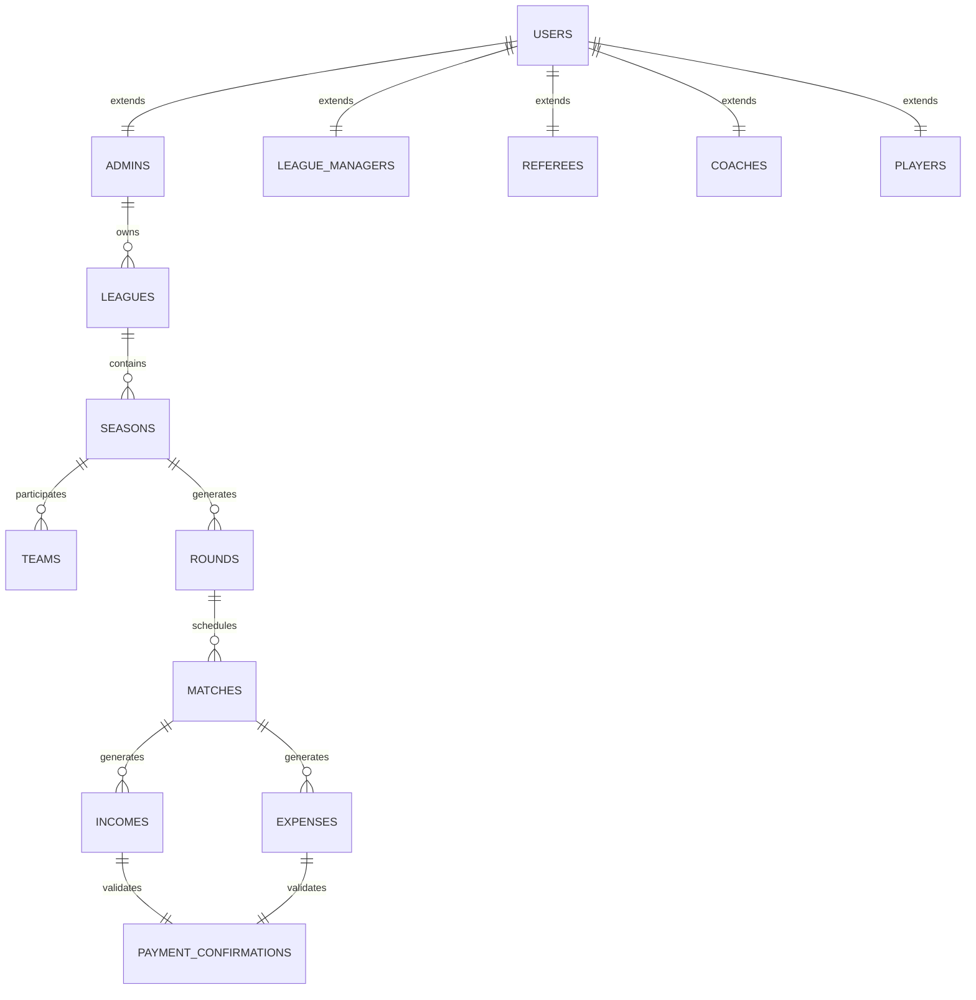

# 🗄️ FlowFast SaaS - Diseño de Base de Datos

## 📋 Índice

1. [Diagrama General](#-diagrama-general)
2. [Estructura Detallada](#️-estructura-detallada)
3. [Migraciones de Laravel](#-migraciones-de-laravel)
4. [Relaciones Principales](#-relaciones-principales)
5. [Índices y Optimización](#⚡-índices-y-optimización)
6. [Datos de Ejemplo](#-datos-de-ejemplo)

---

## 🏗️ Diagrama General



---

## 🏗️ Estructura Detallada

### **1. Sistema de Usuarios (Polimórfico)**

```sql
-- Tabla base polimórfica
CREATE TABLE users (
    id BIGINT UNSIGNED PRIMARY KEY AUTO_INCREMENT,
    email VARCHAR(191) UNIQUE NOT NULL,
    email_verified_at TIMESTAMP NULL,
    password VARCHAR(191) NOT NULL,
    user_type ENUM('admin', 'league_manager', 'referee', 'coach', 'player') NOT NULL,
    userable_id BIGINT UNSIGNED NOT NULL,
    userable_type VARCHAR(191) NOT NULL,
    remember_token VARCHAR(100) NULL,
    created_at TIMESTAMP DEFAULT CURRENT_TIMESTAMP,
    updated_at TIMESTAMP DEFAULT CURRENT_TIMESTAMP ON UPDATE CURRENT_TIMESTAMP,
    
    INDEX idx_user_type (user_type),
    INDEX idx_userable (userable_type, userable_id)
);

-- Administradores (dueños de ligas)
CREATE TABLE admins (
    id BIGINT UNSIGNED PRIMARY KEY AUTO_INCREMENT,
    first_name VARCHAR(100) NOT NULL,
    last_name VARCHAR(100) NOT NULL,
    phone VARCHAR(20),
    company_name VARCHAR(191),
    subscription_plan_id BIGINT UNSIGNED,
    subscription_status ENUM('active', 'suspended', 'cancelled') DEFAULT 'active',
    subscription_expires_at TIMESTAMP NULL,
    brand_logo VARCHAR(191) NULL,
    brand_colors JSON NULL,
    created_at TIMESTAMP DEFAULT CURRENT_TIMESTAMP,
    updated_at TIMESTAMP DEFAULT CURRENT_TIMESTAMP ON UPDATE CURRENT_TIMESTAMP,
    
    INDEX idx_subscription_status (subscription_status),
    INDEX idx_subscription_expires (subscription_expires_at)
);

-- Encargados de Liga/Cancha
CREATE TABLE league_managers (
    id BIGINT UNSIGNED PRIMARY KEY AUTO_INCREMENT,
    first_name VARCHAR(100) NOT NULL,
    last_name VARCHAR(100) NOT NULL,
    phone VARCHAR(20),
    admin_id BIGINT UNSIGNED NOT NULL,
    assigned_leagues JSON NULL, -- IDs de ligas asignadas
    permissions JSON NULL, -- permisos específicos
    created_at TIMESTAMP DEFAULT CURRENT_TIMESTAMP,
    updated_at TIMESTAMP DEFAULT CURRENT_TIMESTAMP ON UPDATE CURRENT_TIMESTAMP,
    
    FOREIGN KEY (admin_id) REFERENCES admins(id) ON DELETE CASCADE,
    INDEX idx_admin_id (admin_id)
);

-- Árbitros (mesa + silbantes)
CREATE TABLE referees (
    id BIGINT UNSIGNED PRIMARY KEY AUTO_INCREMENT,
    first_name VARCHAR(100) NOT NULL,
    last_name VARCHAR(100) NOT NULL,
    phone VARCHAR(20),
    referee_type ENUM('main', 'assistant', 'scorer') NOT NULL,
    league_id BIGINT UNSIGNED,
    payment_rate DECIMAL(10,2) DEFAULT 0.00,
    availability JSON NULL, -- días y horarios disponibles
    created_at TIMESTAMP DEFAULT CURRENT_TIMESTAMP,
    updated_at TIMESTAMP DEFAULT CURRENT_TIMESTAMP ON UPDATE CURRENT_TIMESTAMP,
    
    INDEX idx_referee_type (referee_type),
    INDEX idx_league_id (league_id)
);

-- Entrenadores/Encargados de Equipo
CREATE TABLE coaches (
    id BIGINT UNSIGNED PRIMARY KEY AUTO_INCREMENT,
    first_name VARCHAR(100) NOT NULL,
    last_name VARCHAR(100) NOT NULL,
    phone VARCHAR(20),
    team_id BIGINT UNSIGNED NULL,
    license_number VARCHAR(50) NULL,
    experience_years INT DEFAULT 0,
    created_at TIMESTAMP DEFAULT CURRENT_TIMESTAMP,
    updated_at TIMESTAMP DEFAULT CURRENT_TIMESTAMP ON UPDATE CURRENT_TIMESTAMP,
    
    INDEX idx_team_id (team_id)
);

-- Jugadores
CREATE TABLE players (
    id BIGINT UNSIGNED PRIMARY KEY AUTO_INCREMENT,
    first_name VARCHAR(100) NOT NULL,
    last_name VARCHAR(100) NOT NULL,
    phone VARCHAR(20),
    team_id BIGINT UNSIGNED NULL,
    jersey_number INT,
    position VARCHAR(50),
    birth_date DATE,
    created_at TIMESTAMP DEFAULT CURRENT_TIMESTAMP,
    updated_at TIMESTAMP DEFAULT CURRENT_TIMESTAMP ON UPDATE CURRENT_TIMESTAMP,
    
    INDEX idx_team_id (team_id),
    UNIQUE KEY unique_jersey_team (team_id, jersey_number)
);
```

### **2. Sistema de Tokens de Invitación**

```sql
CREATE TABLE invitation_tokens (
    id BIGINT UNSIGNED PRIMARY KEY AUTO_INCREMENT,
    token VARCHAR(191) UNIQUE NOT NULL,
    token_type ENUM('league_manager', 'referee', 'coach', 'player') NOT NULL,
    issued_by_user_id BIGINT UNSIGNED NOT NULL,
    target_league_id BIGINT UNSIGNED NULL,
    target_team_id BIGINT UNSIGNED NULL,
    metadata JSON NULL, -- información adicional del token
    max_uses INT DEFAULT 1, -- para tokens de jugadores multi-uso
    current_uses INT DEFAULT 0,
    expires_at TIMESTAMP NOT NULL,
    created_at TIMESTAMP DEFAULT CURRENT_TIMESTAMP,
    used_at TIMESTAMP NULL,
    
    FOREIGN KEY (issued_by_user_id) REFERENCES users(id) ON DELETE CASCADE,
    INDEX idx_token_type (token_type),
    INDEX idx_expires_at (expires_at),
    INDEX idx_issued_by (issued_by_user_id)
);
```

### **3. Ligas y Competencias**

```sql
-- Deportes disponibles
CREATE TABLE sports (
    id BIGINT UNSIGNED PRIMARY KEY AUTO_INCREMENT,
    name VARCHAR(100) NOT NULL,
    slug VARCHAR(100) UNIQUE NOT NULL,
    players_per_team INT DEFAULT 11,
    match_duration INT DEFAULT 90, -- minutos
    scoring_system JSON NULL, -- puntos por victoria, empate, derrota
    created_at TIMESTAMP DEFAULT CURRENT_TIMESTAMP
);

-- Ligas principales
CREATE TABLE leagues (
    id BIGINT UNSIGNED PRIMARY KEY AUTO_INCREMENT,
    name VARCHAR(191) NOT NULL,
    slug VARCHAR(191) UNIQUE NOT NULL,
    sport_id BIGINT UNSIGNED NOT NULL,
    admin_id BIGINT UNSIGNED NOT NULL,
    manager_id BIGINT UNSIGNED NULL,
    description TEXT,
    registration_fee DECIMAL(10,2) DEFAULT 0.00,
    match_fee_per_team DECIMAL(10,2) DEFAULT 0.00,
    penalty_fee DECIMAL(10,2) DEFAULT 0.00,
    referee_payment DECIMAL(10,2) DEFAULT 0.00,
    status ENUM('draft', 'active', 'inactive', 'archived') DEFAULT 'draft',
    created_at TIMESTAMP DEFAULT CURRENT_TIMESTAMP,
    updated_at TIMESTAMP DEFAULT CURRENT_TIMESTAMP ON UPDATE CURRENT_TIMESTAMP,
    
    FOREIGN KEY (sport_id) REFERENCES sports(id),
    FOREIGN KEY (admin_id) REFERENCES admins(id) ON DELETE CASCADE,
    FOREIGN KEY (manager_id) REFERENCES league_managers(id) ON DELETE SET NULL,
    INDEX idx_admin_id (admin_id),
    INDEX idx_sport_id (sport_id),
    INDEX idx_status (status)
);

-- Configuración de páginas públicas
CREATE TABLE league_public_pages (
    id BIGINT UNSIGNED PRIMARY KEY AUTO_INCREMENT,
    league_id BIGINT UNSIGNED NOT NULL,
    is_public BOOLEAN DEFAULT TRUE,
    custom_domain VARCHAR(191) NULL,
    seo_title VARCHAR(191),
    seo_description TEXT,
    custom_css TEXT NULL,
    social_links JSON NULL,
    contact_info JSON NULL,
    created_at TIMESTAMP DEFAULT CURRENT_TIMESTAMP,
    updated_at TIMESTAMP DEFAULT CURRENT_TIMESTAMP ON UPDATE CURRENT_TIMESTAMP,
    
    FOREIGN KEY (league_id) REFERENCES leagues(id) ON DELETE CASCADE,
    UNIQUE KEY unique_league_public (league_id)
);

-- Temporadas
CREATE TABLE seasons (
    id BIGINT UNSIGNED PRIMARY KEY AUTO_INCREMENT,
    league_id BIGINT UNSIGNED NOT NULL,
    name VARCHAR(191) NOT NULL,
    format ENUM('league', 'playoff', 'league_playoff') DEFAULT 'league',
    round_robin_type ENUM('single', 'double') DEFAULT 'single',
    start_date DATE NOT NULL,
    end_date DATE NULL,
    game_days JSON NOT NULL, -- ['monday', 'wednesday', 'friday']
    daily_matches INT DEFAULT 2,
    match_times JSON NOT NULL, -- ['18:00', '20:00']
    status ENUM('draft', 'active', 'completed', 'cancelled') DEFAULT 'draft',
    created_at TIMESTAMP DEFAULT CURRENT_TIMESTAMP,
    updated_at TIMESTAMP DEFAULT CURRENT_TIMESTAMP ON UPDATE CURRENT_TIMESTAMP,
    
    FOREIGN KEY (league_id) REFERENCES leagues(id) ON DELETE CASCADE,
    INDEX idx_league_id (league_id),
    INDEX idx_status (status),
    INDEX idx_dates (start_date, end_date)
);

-- Equipos
CREATE TABLE teams (
    id BIGINT UNSIGNED PRIMARY KEY AUTO_INCREMENT,
    name VARCHAR(191) NOT NULL,
    slug VARCHAR(191) NOT NULL,
    season_id BIGINT UNSIGNED NOT NULL,
    coach_id BIGINT UNSIGNED NULL,
    logo VARCHAR(191) NULL,
    primary_color VARCHAR(7) DEFAULT '#000000',
    secondary_color VARCHAR(7) DEFAULT '#FFFFFF',
    registration_paid BOOLEAN DEFAULT FALSE,
    registration_paid_at TIMESTAMP NULL,
    created_at TIMESTAMP DEFAULT CURRENT_TIMESTAMP,
    updated_at TIMESTAMP DEFAULT CURRENT_TIMESTAMP ON UPDATE CURRENT_TIMESTAMP,
    
    FOREIGN KEY (season_id) REFERENCES seasons(id) ON DELETE CASCADE,
    FOREIGN KEY (coach_id) REFERENCES coaches(id) ON DELETE SET NULL,
    UNIQUE KEY unique_team_season (name, season_id),
    INDEX idx_season_id (season_id),
    INDEX idx_registration_paid (registration_paid)
);
```

### **4. Sistema de Partidos y Jornadas**

```sql
-- Jornadas (generadas automáticamente)
CREATE TABLE rounds (
    id BIGINT UNSIGNED PRIMARY KEY AUTO_INCREMENT,
    season_id BIGINT UNSIGNED NOT NULL,
    round_number INT NOT NULL,
    name VARCHAR(100), -- "Jornada 1", "Semifinal", etc.
    start_date DATE,
    end_date DATE,
    created_at TIMESTAMP DEFAULT CURRENT_TIMESTAMP,
    
    FOREIGN KEY (season_id) REFERENCES seasons(id) ON DELETE CASCADE,
    UNIQUE KEY unique_round_season (season_id, round_number),
    INDEX idx_season_id (season_id)
);

-- Partidos individuales (Liga Regular)
CREATE TABLE matches (
    id BIGINT UNSIGNED PRIMARY KEY AUTO_INCREMENT,
    round_id BIGINT UNSIGNED NOT NULL,
    home_team_id BIGINT UNSIGNED NOT NULL,
    away_team_id BIGINT UNSIGNED NOT NULL,
    match_date DATETIME NOT NULL,
    venue VARCHAR(191),
    status ENUM('scheduled', 'in_progress', 'completed', 'cancelled', 'postponed') DEFAULT 'scheduled',
    home_score INT NULL,
    away_score INT NULL,
    created_at TIMESTAMP DEFAULT CURRENT_TIMESTAMP,
    updated_at TIMESTAMP DEFAULT CURRENT_TIMESTAMP ON UPDATE CURRENT_TIMESTAMP,
    
    FOREIGN KEY (round_id) REFERENCES rounds(id) ON DELETE CASCADE,
    FOREIGN KEY (home_team_id) REFERENCES teams(id) ON DELETE CASCADE,
    FOREIGN KEY (away_team_id) REFERENCES teams(id) ON DELETE CASCADE,
    INDEX idx_round_id (round_id),
    INDEX idx_match_date (match_date),
    INDEX idx_status (status),
    INDEX idx_teams (home_team_id, away_team_id)
);

-- Partidos Amistosos (Fuera de Liga Regular)
CREATE TABLE friendly_matches (
    id BIGINT UNSIGNED PRIMARY KEY AUTO_INCREMENT,
    league_id BIGINT UNSIGNED NOT NULL, -- Liga organizadora
    sport_id BIGINT UNSIGNED NOT NULL, -- Debe coincidir con el deporte de la liga
    home_team_id BIGINT UNSIGNED NOT NULL,
    away_team_id BIGINT UNSIGNED NOT NULL,
    match_date DATETIME NOT NULL,
    venue VARCHAR(191),
    status ENUM('scheduled', 'in_progress', 'completed', 'cancelled', 'postponed') DEFAULT 'scheduled',
    home_score INT NULL,
    away_score INT NULL,
    
    -- Configuración financiera específica del amistoso
    match_fee_amount DECIMAL(10,2) NOT NULL DEFAULT 0, -- Costo por equipo
    referee_payment_amount DECIMAL(10,2) NOT NULL DEFAULT 0, -- Pago total a árbitros
    venue_rental_cost DECIMAL(10,2) DEFAULT 0, -- Costo del alquiler de cancha
    
    -- Metadatos
    description TEXT NULL, -- Descripción del amistoso
    is_public BOOLEAN DEFAULT TRUE, -- Si aparece en página pública
    notes TEXT NULL, -- Notas adicionales
    
    created_by BIGINT UNSIGNED NOT NULL, -- Quien creó el amistoso
    created_at TIMESTAMP DEFAULT CURRENT_TIMESTAMP,
    updated_at TIMESTAMP DEFAULT CURRENT_TIMESTAMP ON UPDATE CURRENT_TIMESTAMP,
    
    FOREIGN KEY (league_id) REFERENCES leagues(id) ON DELETE CASCADE,
    FOREIGN KEY (sport_id) REFERENCES sports(id),
    FOREIGN KEY (home_team_id) REFERENCES teams(id) ON DELETE CASCADE,
    FOREIGN KEY (away_team_id) REFERENCES teams(id) ON DELETE CASCADE,
    FOREIGN KEY (created_by) REFERENCES users(id),
    
    INDEX idx_league_id (league_id),
    INDEX idx_sport_id (sport_id),
    INDEX idx_match_date (match_date),
    INDEX idx_status (status),
    INDEX idx_teams (home_team_id, away_team_id),
    INDEX idx_created_by (created_by)
);

-- Árbitros asignados por partido (Liga Regular)
CREATE TABLE match_officials (
    id BIGINT UNSIGNED PRIMARY KEY AUTO_INCREMENT,
    match_id BIGINT UNSIGNED NOT NULL,
    referee_id BIGINT UNSIGNED NOT NULL,
    role ENUM('main', 'assistant', 'scorer') NOT NULL,
    confirmed BOOLEAN DEFAULT FALSE,
    created_at TIMESTAMP DEFAULT CURRENT_TIMESTAMP,
    
    FOREIGN KEY (match_id) REFERENCES matches(id) ON DELETE CASCADE,
    FOREIGN KEY (referee_id) REFERENCES referees(id) ON DELETE CASCADE,
    UNIQUE KEY unique_match_referee_role (match_id, referee_id, role),
    INDEX idx_match_id (match_id),
    INDEX idx_referee_id (referee_id)
);

-- Árbitros asignados por partido amistoso
CREATE TABLE friendly_match_officials (
    id BIGINT UNSIGNED PRIMARY KEY AUTO_INCREMENT,
    friendly_match_id BIGINT UNSIGNED NOT NULL,
    referee_id BIGINT UNSIGNED NOT NULL,
    role ENUM('main', 'assistant', 'scorer') NOT NULL,
    confirmed BOOLEAN DEFAULT FALSE,
    payment_amount DECIMAL(10,2) DEFAULT 0, -- Pago específico para este árbitro
    created_at TIMESTAMP DEFAULT CURRENT_TIMESTAMP,
    
    FOREIGN KEY (friendly_match_id) REFERENCES friendly_matches(id) ON DELETE CASCADE,
    FOREIGN KEY (referee_id) REFERENCES referees(id) ON DELETE CASCADE,
    UNIQUE KEY unique_friendly_referee_role (friendly_match_id, referee_id, role),
    INDEX idx_friendly_match_id (friendly_match_id),
    INDEX idx_referee_id (referee_id)
);

-- Tabla de posiciones (calculada automáticamente)
CREATE TABLE standings (
    id BIGINT UNSIGNED PRIMARY KEY AUTO_INCREMENT,
    season_id BIGINT UNSIGNED NOT NULL,
    team_id BIGINT UNSIGNED NOT NULL,
    matches_played INT DEFAULT 0,
    wins INT DEFAULT 0,
    draws INT DEFAULT 0,
    losses INT DEFAULT 0,
    goals_for INT DEFAULT 0,
    goals_against INT DEFAULT 0,
    goal_difference INT DEFAULT 0,
    points INT DEFAULT 0,
    position INT DEFAULT 0,
    updated_at TIMESTAMP DEFAULT CURRENT_TIMESTAMP ON UPDATE CURRENT_TIMESTAMP,
    
    FOREIGN KEY (season_id) REFERENCES seasons(id) ON DELETE CASCADE,
    FOREIGN KEY (team_id) REFERENCES teams(id) ON DELETE CASCADE,
    UNIQUE KEY unique_season_team (season_id, team_id),
    INDEX idx_season_points (season_id, points DESC),
    INDEX idx_position (position)
);
```

### **5. Sistema Financiero Integral**

```sql
-- Tipos de ingresos
CREATE TABLE income_types (
    id BIGINT UNSIGNED PRIMARY KEY AUTO_INCREMENT,
    name VARCHAR(100) NOT NULL,
    slug VARCHAR(100) UNIQUE NOT NULL,
    description TEXT,
    is_automatic BOOLEAN DEFAULT FALSE, -- se genera automáticamente
    created_at TIMESTAMP DEFAULT CURRENT_TIMESTAMP
);

-- Registro de ingresos
CREATE TABLE incomes (
    id BIGINT UNSIGNED PRIMARY KEY AUTO_INCREMENT,
    income_type_id BIGINT UNSIGNED NOT NULL,
    league_id BIGINT UNSIGNED NOT NULL,
    season_id BIGINT UNSIGNED NULL,
    team_id BIGINT UNSIGNED NULL,
    match_id BIGINT UNSIGNED NULL, -- Para partidos de liga regular
    friendly_match_id BIGINT UNSIGNED NULL, -- Para partidos amistosos
    amount DECIMAL(10,2) NOT NULL,
    payment_method ENUM('cash', 'card', 'transfer') NOT NULL,
    payment_status ENUM('pending', 'paid', 'confirmed', 'cancelled') DEFAULT 'pending',
    description TEXT,
    due_date DATE NULL,
    paid_at TIMESTAMP NULL,
    confirmed_at TIMESTAMP NULL,
    created_by BIGINT UNSIGNED NOT NULL,
    created_at TIMESTAMP DEFAULT CURRENT_TIMESTAMP,
    updated_at TIMESTAMP DEFAULT CURRENT_TIMESTAMP ON UPDATE CURRENT_TIMESTAMP,
    
    FOREIGN KEY (income_type_id) REFERENCES income_types(id),
    FOREIGN KEY (league_id) REFERENCES leagues(id) ON DELETE CASCADE,
    FOREIGN KEY (season_id) REFERENCES seasons(id) ON DELETE SET NULL,
    FOREIGN KEY (team_id) REFERENCES teams(id) ON DELETE SET NULL,
    FOREIGN KEY (match_id) REFERENCES matches(id) ON DELETE SET NULL,
    FOREIGN KEY (friendly_match_id) REFERENCES friendly_matches(id) ON DELETE SET NULL,
    FOREIGN KEY (created_by) REFERENCES users(id),
    INDEX idx_league_id (league_id),
    INDEX idx_payment_status (payment_status),
    INDEX idx_created_at (created_at),
    INDEX idx_match_id (match_id),
    INDEX idx_friendly_match_id (friendly_match_id)
);

-- Tipos de egresos
CREATE TABLE expense_types (
    id BIGINT UNSIGNED PRIMARY KEY AUTO_INCREMENT,
    name VARCHAR(100) NOT NULL,
    slug VARCHAR(100) UNIQUE NOT NULL,
    description TEXT,
    is_automatic BOOLEAN DEFAULT FALSE,
    created_at TIMESTAMP DEFAULT CURRENT_TIMESTAMP
);

-- Registro de egresos
CREATE TABLE expenses (
    id BIGINT UNSIGNED PRIMARY KEY AUTO_INCREMENT,
    expense_type_id BIGINT UNSIGNED NOT NULL,
    league_id BIGINT UNSIGNED NOT NULL,
    match_id BIGINT UNSIGNED NULL, -- Para partidos de liga regular
    friendly_match_id BIGINT UNSIGNED NULL, -- Para partidos amistosos
    referee_id BIGINT UNSIGNED NULL,
    amount DECIMAL(10,2) NOT NULL,
    payment_method ENUM('cash', 'card', 'transfer') NOT NULL,
    payment_status ENUM('pending', 'paid', 'confirmed', 'cancelled') DEFAULT 'pending',
    description TEXT,
    due_date DATE NULL,
    paid_at TIMESTAMP NULL,
    confirmed_at TIMESTAMP NULL,
    created_by BIGINT UNSIGNED NOT NULL,
    created_at TIMESTAMP DEFAULT CURRENT_TIMESTAMP,
    updated_at TIMESTAMP DEFAULT CURRENT_TIMESTAMP ON UPDATE CURRENT_TIMESTAMP,
    
    FOREIGN KEY (expense_type_id) REFERENCES expense_types(id),
    FOREIGN KEY (league_id) REFERENCES leagues(id) ON DELETE CASCADE,
    FOREIGN KEY (match_id) REFERENCES matches(id) ON DELETE SET NULL,
    FOREIGN KEY (friendly_match_id) REFERENCES friendly_matches(id) ON DELETE SET NULL,
    FOREIGN KEY (referee_id) REFERENCES referees(id) ON DELETE SET NULL,
    FOREIGN KEY (created_by) REFERENCES users(id),
    INDEX idx_league_id (league_id),
    INDEX idx_payment_status (payment_status),
    INDEX idx_created_at (created_at),
    INDEX idx_match_id (match_id),
    INDEX idx_friendly_match_id (friendly_match_id)
);

-- Sistema de confirmación de pagos
CREATE TABLE payment_confirmations (
    id BIGINT UNSIGNED PRIMARY KEY AUTO_INCREMENT,
    confirmable_type ENUM('income', 'expense') NOT NULL,
    confirmable_id BIGINT UNSIGNED NOT NULL,
    step_number TINYINT NOT NULL, -- 1, 2, 3
    confirmed_by BIGINT UNSIGNED NOT NULL,
    confirmation_role ENUM('payer', 'receiver', 'admin', 'system') NOT NULL,
    notes TEXT NULL,
    proof_document VARCHAR(191) NULL,
    confirmed_at TIMESTAMP DEFAULT CURRENT_TIMESTAMP,
    
    FOREIGN KEY (confirmed_by) REFERENCES users(id),
    INDEX idx_confirmable (confirmable_type, confirmable_id),
    INDEX idx_step_number (step_number),
    INDEX idx_confirmed_at (confirmed_at)
);
```

### **6. Sistema de Membresías SaaS**

```sql
-- Planes de suscripción
CREATE TABLE subscription_plans (
    id BIGINT UNSIGNED PRIMARY KEY AUTO_INCREMENT,
    name VARCHAR(100) NOT NULL,
    slug VARCHAR(100) UNIQUE NOT NULL,
    price DECIMAL(10,2) NOT NULL,
    currency VARCHAR(3) DEFAULT 'USD',
    billing_cycle ENUM('monthly', 'quarterly', 'yearly') DEFAULT 'monthly',
    max_leagues INT NULL,
    max_teams_per_league INT NULL,
    features JSON NOT NULL,
    is_active BOOLEAN DEFAULT TRUE,
    created_at TIMESTAMP DEFAULT CURRENT_TIMESTAMP,
    updated_at TIMESTAMP DEFAULT CURRENT_TIMESTAMP ON UPDATE CURRENT_TIMESTAMP,
    
    INDEX idx_is_active (is_active)
);

-- Suscripciones de administradores
CREATE TABLE admin_subscriptions (
    id BIGINT UNSIGNED PRIMARY KEY AUTO_INCREMENT,
    admin_id BIGINT UNSIGNED NOT NULL,
    subscription_plan_id BIGINT UNSIGNED NOT NULL,
    status ENUM('active', 'cancelled', 'suspended', 'expired') DEFAULT 'active',
    current_period_start DATE NOT NULL,
    current_period_end DATE NOT NULL,
    stripe_subscription_id VARCHAR(191) NULL,
    trial_ends_at DATE NULL,
    created_at TIMESTAMP DEFAULT CURRENT_TIMESTAMP,
    updated_at TIMESTAMP DEFAULT CURRENT_TIMESTAMP ON UPDATE CURRENT_TIMESTAMP,
    
    FOREIGN KEY (admin_id) REFERENCES admins(id) ON DELETE CASCADE,
    FOREIGN KEY (subscription_plan_id) REFERENCES subscription_plans(id),
    INDEX idx_admin_id (admin_id),
    INDEX idx_status (status),
    INDEX idx_period_end (current_period_end)
);

-- Notificaciones de pago
CREATE TABLE payment_notifications (
    id BIGINT UNSIGNED PRIMARY KEY AUTO_INCREMENT,
    admin_subscription_id BIGINT UNSIGNED NOT NULL,
    notification_type ENUM('7_days', '3_days', 'due_date', 'overdue') NOT NULL,
    sent_at TIMESTAMP NULL,
    read_at TIMESTAMP NULL,
    action_taken ENUM('renewed', 'cancelled', 'ignored') NULL,
    created_at TIMESTAMP DEFAULT CURRENT_TIMESTAMP,
    
    FOREIGN KEY (admin_subscription_id) REFERENCES admin_subscriptions(id) ON DELETE CASCADE,
    INDEX idx_subscription_id (admin_subscription_id),
    INDEX idx_notification_type (notification_type),
    INDEX idx_sent_at (sent_at)
);
```

### **7. Sistema de Apelaciones**

```sql
-- Apelaciones de partidos
CREATE TABLE match_appeals (
    id BIGINT UNSIGNED PRIMARY KEY AUTO_INCREMENT,
    match_id BIGINT UNSIGNED NOT NULL,
    requesting_team_id BIGINT UNSIGNED NOT NULL,
    appeal_type ENUM('date_change', 'time_change', 'venue_change', 'postponement') NOT NULL,
    reason TEXT NOT NULL,
    proposed_date DATETIME NULL,
    proposed_venue VARCHAR(191) NULL,
    league_manager_approval ENUM('pending', 'approved', 'rejected') DEFAULT 'pending',
    opposing_team_approval ENUM('pending', 'approved', 'rejected') DEFAULT 'pending',
    final_status ENUM('pending', 'approved', 'rejected') DEFAULT 'pending',
    manager_notes TEXT NULL,
    processed_at TIMESTAMP NULL,
    created_at TIMESTAMP DEFAULT CURRENT_TIMESTAMP,
    updated_at TIMESTAMP DEFAULT CURRENT_TIMESTAMP ON UPDATE CURRENT_TIMESTAMP,
    
    FOREIGN KEY (match_id) REFERENCES matches(id) ON DELETE CASCADE,
    FOREIGN KEY (requesting_team_id) REFERENCES teams(id) ON DELETE CASCADE,
    INDEX idx_match_id (match_id),
    INDEX idx_final_status (final_status),
    INDEX idx_created_at (created_at)
);
```

### **8. Analytics y Reportes**

```sql
-- Analytics de páginas públicas
CREATE TABLE public_page_analytics (
    id BIGINT UNSIGNED PRIMARY KEY AUTO_INCREMENT,
    league_id BIGINT UNSIGNED NOT NULL,
    page_views INT DEFAULT 0,
    unique_visitors INT DEFAULT 0,
    bounce_rate DECIMAL(5,2) DEFAULT 0.00,
    avg_session_duration INT DEFAULT 0, -- segundos
    popular_content JSON NULL,
    visitor_locations JSON NULL,
    date DATE NOT NULL,
    created_at TIMESTAMP DEFAULT CURRENT_TIMESTAMP,
    
    FOREIGN KEY (league_id) REFERENCES leagues(id) ON DELETE CASCADE,
    UNIQUE KEY unique_league_date (league_id, date),
    INDEX idx_date (date)
);

-- Cache de reportes financieros
CREATE TABLE financial_reports_cache (
    id BIGINT UNSIGNED PRIMARY KEY AUTO_INCREMENT,
    league_id BIGINT UNSIGNED NOT NULL,
    report_type ENUM('income_summary', 'expense_summary', 'profit_loss', 'monthly_summary') NOT NULL,
    period_start DATE NOT NULL,
    period_end DATE NOT NULL,
    report_data JSON NOT NULL,
    generated_at TIMESTAMP DEFAULT CURRENT_TIMESTAMP,
    expires_at TIMESTAMP NOT NULL,
    
    FOREIGN KEY (league_id) REFERENCES leagues(id) ON DELETE CASCADE,
    INDEX idx_league_type (league_id, report_type),
    INDEX idx_expires_at (expires_at)
);
```

---

## 🔄 Migraciones de Laravel

### **Orden de Creación:**

```bash
# 1. Tablas base
php artisan make:migration create_sports_table
php artisan make:migration create_users_table
php artisan make:migration create_admins_table
php artisan make:migration create_league_managers_table
php artisan make:migration create_referees_table
php artisan make:migration create_coaches_table
php artisan make:migration create_players_table

# 2. Sistema de tokens
php artisan make:migration create_invitation_tokens_table

# 3. Ligas y competencias
php artisan make:migration create_leagues_table
php artisan make:migration create_league_public_pages_table
php artisan make:migration create_seasons_table
php artisan make:migration create_teams_table
php artisan make:migration create_rounds_table
php artisan make:migration create_matches_table
php artisan make:migration create_match_officials_table
php artisan make:migration create_standings_table

# 4. Sistema financiero
php artisan make:migration create_income_types_table
php artisan make:migration create_expense_types_table
php artisan make:migration create_incomes_table
php artisan make:migration create_expenses_table
php artisan make:migration create_payment_confirmations_table

# 5. Membresías
php artisan make:migration create_subscription_plans_table
php artisan make:migration create_admin_subscriptions_table
php artisan make:migration create_payment_notifications_table

# 6. Funcionalidades avanzadas
php artisan make:migration create_match_appeals_table
php artisan make:migration create_public_page_analytics_table
php artisan make:migration create_financial_reports_cache_table
```

---

## 🔗 Relaciones Principales

### **Modelo User (Polimórfico):**
```php
// app/Models/User.php
public function userable()
{
    return $this->morphTo();
}
```

### **Modelo Admin:**
```php
// app/Models/Admin.php
public function user()
{
    return $this->morphOne(User::class, 'userable');
}

public function leagues()
{
    return $this->hasMany(League::class);
}

public function subscription()
{
    return $this->hasOne(AdminSubscription::class);
}
```

### **Modelo League:**
```php
// app/Models/League.php
public function admin()
{
    return $this->belongsTo(Admin::class);
}

public function manager()
{
    return $this->belongsTo(LeagueManager::class);
}

public function sport()
{
    return $this->belongsTo(Sport::class);
}

public function seasons()
{
    return $this->hasMany(Season::class);
}

public function publicPage()
{
    return $this->hasOne(LeaguePublicPage::class);
}
```

### **Modelo Match:**
```php
// app/Models/Match.php
public function homeTeam()
{
    return $this->belongsTo(Team::class, 'home_team_id');
}

public function awayTeam()
{
    return $this->belongsTo(Team::class, 'away_team_id');
}

public function officials()
{
    return $this->hasMany(MatchOfficial::class);
}

public function incomes()
{
    return $this->hasMany(Income::class);
}

public function expenses()
{
    return $this->hasMany(Expense::class);
}
```

---

## ⚡ Índices y Optimización

### **Índices Críticos para Performance:**

```sql
-- Para consultas de dashboard financiero
CREATE INDEX idx_incomes_league_status_date ON incomes(league_id, payment_status, created_at);
CREATE INDEX idx_expenses_league_status_date ON expenses(league_id, payment_status, created_at);

-- Para tabla de posiciones
CREATE INDEX idx_standings_season_points ON standings(season_id, points DESC, goal_difference DESC);

-- Para calendario de partidos
CREATE INDEX idx_matches_date_status ON matches(match_date, status);
CREATE INDEX idx_matches_teams ON matches(home_team_id, away_team_id, match_date);

-- Para páginas públicas
CREATE INDEX idx_leagues_public ON leagues(status, slug);

-- Para analytics
CREATE INDEX idx_analytics_league_date ON public_page_analytics(league_id, date DESC);
```

### **Configuraciones MySQL Recomendadas:**

```sql
-- En my.cnf o my.ini
innodb_buffer_pool_size = 1G
innodb_log_file_size = 256M
query_cache_size = 64M
max_connections = 200
```

---

## 📊 Datos de Ejemplo

### **Seeders Recomendados:**

```php
// database/seeders/SportsSeeder.php
Sport::create(['name' => 'Fútbol', 'slug' => 'futbol', 'players_per_team' => 11]);
Sport::create(['name' => 'Básquetbol', 'slug' => 'basquetbol', 'players_per_team' => 5]);
Sport::create(['name' => 'Voleibol', 'slug' => 'voleibol', 'players_per_team' => 6]);

// database/seeders/IncomeTypesSeeder.php
IncomeType::create(['name' => 'Cuota de Inscripción', 'slug' => 'registration_fee', 'is_automatic' => false]);
IncomeType::create(['name' => 'Pago por Partido', 'slug' => 'match_fee', 'is_automatic' => true]);
IncomeType::create(['name' => 'Multa/Penalización', 'slug' => 'penalty_fee', 'is_automatic' => false]);

// database/seeders/ExpenseTypesSeeder.php
ExpenseType::create(['name' => 'Pago a Árbitros', 'slug' => 'referee_payment', 'is_automatic' => true]);
ExpenseType::create(['name' => 'Alquiler de Cancha', 'slug' => 'venue_cost', 'is_automatic' => false]);

// database/seeders/SubscriptionPlansSeeder.php
SubscriptionPlan::create([
    'name' => 'Básico',
    'slug' => 'basic',
    'price' => 29.99,
    'max_leagues' => 2,
    'max_teams_per_league' => 16,
    'features' => ['basic_reports', 'email_support']
]);
```

---

## 🚀 Próximos Pasos

1. **Crear todas las migraciones** en el orden especificado
2. **Implementar los modelos** con las relaciones definidas
3. **Crear los seeders** para datos base
4. **Configurar índices** de performance
5. **Implementar soft deletes** en tablas críticas
6. **Configurar backup** automático de base de datos

---

*¡Esta estructura de base de datos está diseñada para manejar el crecimiento y complejidad del sistema FlowFast SaaS!* 🎯