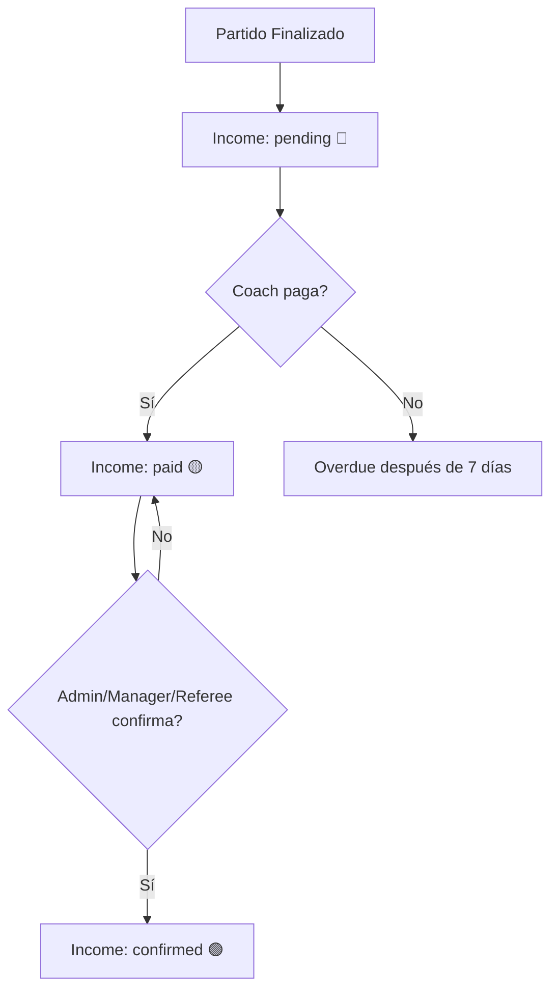
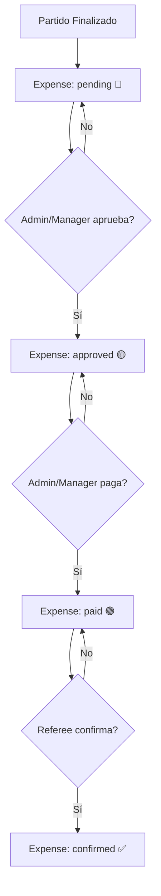

# Flujo de Confirmación de Pagos - Guía de Uso

## 🎯 Objetivo

Este documento explica **paso a paso** cómo funciona el sistema de confirmación de pagos después de finalizar un partido, tanto para **pagos de equipos** como para **pagos a árbitros**.

---

## 📋 Contexto

Cuando un partido es **finalizado**, el sistema automáticamente genera:

1. **2 Ingresos (Income)**: Uno por cada equipo (local y visitante)
2. **N Egresos (Expense)**: Uno por cada árbitro asignado

Estos registros tienen diferentes **estados** que deben ser confirmados según el rol del usuario.

---

## 💰 Flujo 1: Pagos de Equipos (Income)

### **Estados Posibles:**

| Estado | Emoji | Descripción |
|--------|-------|-------------|
| `pending` | 🔴 | Esperando que el equipo pague |
| `paid` | 🟡 | El equipo marcó como pagado |
| `confirmed` | 🟢 | Admin/Manager/Referee confirmó recepción |

### **Paso a Paso:**

#### **1. Partido Finalizado → Income Creado**

```
Estado inicial: pending
- El sistema genera 2 incomes automáticamente
- Monto: Configurado en League (match_fee_per_team)
- Fecha vencimiento: +7 días desde finalización
```

#### **2. Coach/Equipo Marca como Pagado**

```
⚠️ PENDIENTE DE IMPLEMENTAR
- El coach del equipo sube comprobante de pago
- Estado cambia a: paid
- paid_by_user: ID del coach
- paid_at: now()
```

#### **3. Admin/Manager/Referee Confirma Pago**

✅ **YA IMPLEMENTADO**

**Quién puede confirmar:**
- ✅ Admin
- ✅ League Manager
- ✅ Referee

**Cómo confirmar:**

1. Ir al partido: `/admin/matches/{id}/live`
2. Scroll hasta la sección **"💰 Pagos de Equipos"**
3. Ver cada equipo con su estado:
   - 🔴 Pendiente de pago
   - 🟡 Pagado - Por confirmar ← **AQUÍ PUEDES CONFIRMAR**
   - 🟢 Confirmado

4. Click en botón **"✓ Confirmar"**
5. El sistema actualiza:
   ```php
   payment_status: 'confirmed'
   confirmed_by_admin_user: auth()->id()
   confirmed_by_admin_at: now()
   confirmed_at: now()
   ```

---

## 💵 Flujo 2: Pagos a Árbitros (Expense)

### **Estados Posibles:**

| Estado | Emoji | Descripción |
|--------|-------|-------------|
| `pending` | 🔴 | Esperando aprobación de admin/manager |
| `approved` | 🟡 | Aprobado por admin/manager |
| `paid` | 🟢 | Admin/manager marcó como pagado |
| `confirmed` | ✅ | Árbitro confirmó que recibió el dinero |

### **Paso a Paso:**

#### **1. Partido Finalizado → Expense Creado**

```
Estado inicial: pending
- El sistema genera 1 expense por cada árbitro
- Monto según tipo:
  • Principal: 100% (ej: $300)
  • Asistente: 70% (ej: $210)
  • Cuarto Árbitro: 50% (ej: $150)
- Fecha vencimiento: +3 días desde finalización
```

#### **2. Admin/Manager Aprueba el Pago**

✅ **YA IMPLEMENTADO**

**Quién puede aprobar:**
- ✅ Admin
- ✅ League Manager

**Cómo aprobar:**

1. Ir al partido: `/admin/matches/{id}/live`
2. Scroll hasta la sección **"💵 Pagos a Árbitros"**
3. Ver cada árbitro con su estado:
   - 🔴 Pendiente de aprobación ← **AQUÍ PUEDES APROBAR**
   - 🟡 Aprobado - Pendiente de pagar
   - 🟢 Pagado - Esperando confirmación del árbitro
   - ✅ Confirmado por árbitro

4. Click en botón **"✓ Aprobar"**
5. El sistema actualiza:
   ```php
   payment_status: 'approved'
   approved_by: auth()->id()
   approved_at: now()
   ```

#### **3. Admin/Manager Marca como Pagado**

✅ **YA IMPLEMENTADO**

**Cómo marcar como pagado:**

1. En la misma sección **"💵 Pagos a Árbitros"**
2. Buscar el árbitro con estado 🟡 Aprobado
3. Click en botón **"💵 Marcar Pagado"**
4. El sistema actualiza:
   ```php
   payment_status: 'paid'
   paid_by: auth()->id()
   paid_at: now()
   ```

#### **4. Referee Confirma Recepción**

✅ **YA IMPLEMENTADO** ← **TU PREGUNTA**

**Quién puede confirmar:**
- ✅ Solo el árbitro beneficiario

**Cómo confirmar (Referee):**

1. **Login como Referee**
   ```
   http://flowfast-saas.test/login
   ```

2. **Ir a tus partidos**
   ```
   http://flowfast-saas.test/referee/matches
   ```

3. **Click en el partido finalizado**
   ```
   Se abre: http://flowfast-saas.test/admin/matches/{id}/live
   ```

4. **Scroll hasta la sección "💵 Mi Pago como Árbitro"**
   
   Verás tu pago con uno de estos estados:
   - 🔴 Pendiente de aprobación
   - 🟡 Aprobado - En proceso de pago
   - 🟢 Pagado - Confirma recepción ← **AQUÍ CONFIRMAS**
   - ✅ Confirmado recibido

5. **Si está en estado "Pagado" 🟢:**
   - Verás el botón **"✓ Confirmar Recepción"**
   - Click en el botón
   - El sistema actualiza:
     ```php
     payment_status: 'confirmed'
     confirmed_at: now()
     ```

6. **Mensaje de éxito:**
   ```
   ¡Has confirmado la recepción de tu pago exitosamente!
   ```

---

## 🎨 Interfaz Visual

### **Para Admin/Manager:**

```
╔══════════════════════════════════════════════════════════╗
║              💰 Pagos de Equipos                         ║
╠══════════════════════════════════════════════════════════╣
║  Tigres FC                        [✓ Confirmar]          ║
║  $500.00                                                 ║
║  🟡 Pagado - Por confirmar                               ║
╠══════════════════════════════════════════════════════════╣
║  Leones United                                           ║
║  $500.00                                                 ║
║  🟢 Confirmado                                           ║
╚══════════════════════════════════════════════════════════╝

╔══════════════════════════════════════════════════════════╗
║              💵 Pagos a Árbitros                         ║
╠══════════════════════════════════════════════════════════╣
║  Juan Pérez                       [✓ Aprobar]            ║
║  $300.00                                                 ║
║  Pago por arbitraje (Principal)                          ║
║  🔴 Pendiente de aprobación                              ║
╠══════════════════════════════════════════════════════════╣
║  María González                   [💵 Marcar Pagado]     ║
║  $210.00                                                 ║
║  Pago por arbitraje (Asistente)                          ║
║  🟡 Aprobado - Pendiente de pagar                        ║
╠══════════════════════════════════════════════════════════╣
║  Carlos Ruiz                                             ║
║  $300.00                                                 ║
║  Pago por arbitraje (Principal)                          ║
║  🟢 Pagado - Esperando confirmación del árbitro          ║
╚══════════════════════════════════════════════════════════╝
```

### **Para Referee:**

```
╔══════════════════════════════════════════════════════════╗
║           💵 Mi Pago como Árbitro                        ║
╠══════════════════════════════════════════════════════════╣
║  $300.00                          [✓ Confirmar Recepción]║
║  Pago por arbitraje (Principal):                         ║
║  Tigres FC vs Leones United                              ║
║  🟢 Pagado - Confirma recepción                          ║
╚══════════════════════════════════════════════════════════╝

╔══════════════════════════════════════════════════════════╗
║              💰 Pagos de Equipos                         ║
╠══════════════════════════════════════════════════════════╣
║  Tigres FC                        [✓ Confirmar]          ║
║  $500.00                                                 ║
║  🟡 Pagado - Por confirmar                               ║
║  (También puede confirmar pagos de equipos)              ║
╚══════════════════════════════════════════════════════════╝
```

---

## 🔄 Diagrama de Flujo Completo

### **Pagos de Equipos:**



### **Pagos a Árbitros:**



---

## 🧪 Ejemplo de Prueba Completo

### **Escenario: Partido Finalizado con 1 Árbitro**

#### **1. Finalizar Partido (Admin/Manager/Referee):**

```
1. Ir a: http://flowfast-saas.test/admin/fixtures
2. Click en partido
3. Click "▶ Iniciar Partido"
4. Click "⏹ Finalizar Partido"
5. ✅ Se crean:
   - 2 Incomes (pending)
   - 1 Expense (pending)
```

#### **2. Aprobar Pago a Árbitro (Admin/Manager):**

```
1. En la misma página del partido
2. Scroll a "💵 Pagos a Árbitros"
3. Ver estado: 🔴 Pendiente de aprobación
4. Click "✓ Aprobar"
5. ✅ Estado cambia a: 🟡 Aprobado
```

#### **3. Marcar como Pagado (Admin/Manager):**

```
1. Ver estado: 🟡 Aprobado - Pendiente de pagar
2. Click "💵 Marcar Pagado"
3. ✅ Estado cambia a: 🟢 Pagado - Esperando confirmación
```

#### **4. Confirmar Recepción (Referee):**

```
1. Logout y login como Referee
2. Ir a: http://flowfast-saas.test/referee/matches
3. Click en el partido
4. Scroll a "💵 Mi Pago como Árbitro"
5. Ver estado: 🟢 Pagado - Confirma recepción
6. Click "✓ Confirmar Recepción"
7. ✅ Estado cambia a: ✅ Confirmado recibido
8. Mensaje: "¡Has confirmado la recepción de tu pago exitosamente!"
```

#### **5. Verificar en Admin:**

```
1. Login como Admin
2. Ver el mismo partido
3. En "💵 Pagos a Árbitros"
4. Ver estado: ✅ Confirmado por árbitro
```

---

## 🛡️ Validaciones de Seguridad

### **Confirmar Pago de Equipo:**

- ✅ Solo admin, league_manager, referee pueden confirmar
- ✅ Solo se puede confirmar si está en estado "paid"
- ❌ No se puede confirmar si está "pending" o "confirmed"

### **Aprobar Pago a Árbitro:**

- ✅ Solo admin, league_manager pueden aprobar
- ✅ Solo se puede aprobar si está en estado "pending"
- ❌ Referee NO puede aprobar

### **Marcar como Pagado:**

- ✅ Solo admin, league_manager pueden marcar
- ✅ Solo se puede marcar si está en estado "approved"
- ❌ Referee NO puede marcar como pagado

### **Confirmar Recepción (Referee):**

- ✅ Solo el referee beneficiario puede confirmar
- ✅ Solo se puede confirmar si está en estado "paid"
- ❌ NO puede confirmar el pago de otro árbitro
- ❌ Admin/Manager NO pueden confirmar por el árbitro

---

## 📊 Reportes y Consultas

### **Ver Todos los Pagos Pendientes:**

```sql
-- Ingresos pendientes de confirmar
SELECT i.*, t.name as team_name
FROM incomes i
JOIN teams t ON i.team_id = t.id
WHERE i.payment_status = 'paid'
ORDER BY i.created_at DESC;

-- Egresos pendientes de aprobar
SELECT e.*, r.first_name, r.last_name
FROM expenses e
JOIN referees r ON e.referee_id = r.id
WHERE e.payment_status = 'pending'
ORDER BY e.created_at DESC;

-- Egresos pagados pero sin confirmar
SELECT e.*, r.first_name, r.last_name
FROM expenses e
JOIN referees r ON e.referee_id = r.id
WHERE e.payment_status = 'paid'
ORDER BY e.created_at DESC;
```

---

## 🚀 Próximas Mejoras

### **Pendientes de Implementar:**

1. **Dashboard de Pagos:**
   - Vista resumen de todos los pagos pendientes
   - Filtros por estado, fecha, árbitro, equipo
   - Total pendiente de aprobar/pagar

2. **Notificaciones:**
   - Email/SMS cuando se aprueba un pago
   - Email/SMS cuando se marca como pagado
   - Recordatorios de pagos pendientes

3. **Comprobantes de Pago:**
   - Upload de comprobante por parte del coach
   - Upload de comprobante de transferencia por admin
   - Galería de comprobantes

4. **Historial de Transacciones:**
   - Log de quién aprobó, cuándo
   - Log de quién pagó, cuándo
   - Log de quién confirmó, cuándo

5. **Reportes Financieros:**
   - Balance por liga
   - Balance por temporada
   - Pagos a árbitros por mes
   - Ingresos por equipos

---

## 📝 Archivos Modificados

### **Backend:**

1. ✅ `app/Livewire/Matches/Live.php`
   - Agregado: `confirmTeamPayment()`
   - Agregado: `confirmMyPayment()`
   - Agregado: `approveRefereePayment()`
   - Agregado: `markAsPaid()`
   - Modificado: `mount()` para cargar incomes y expenses

### **Frontend:**

2. ✅ `resources/views/livewire/matches/live.blade.php`
   - Agregada sección: "💰 Pagos de Equipos"
   - Agregada sección: "💵 Mi Pago como Árbitro" (para referee)
   - Agregada sección: "💵 Pagos a Árbitros" (para admin/manager)

---

## ✅ Resumen

**Tu pregunta era:** "como lo veo en referee, ya le di listo para pagar en admin ahora que sigue"

**Respuesta:**

1. ✅ Ya marcaste como "Pagado" desde admin
2. ✅ Estado actual del Expense: `paid` 🟢
3. ✅ **Ahora el referee debe:**
   - Login como referee
   - Ir a `/referee/matches`
   - Abrir el partido
   - Ver sección "💵 Mi Pago como Árbitro"
   - Click en "✓ Confirmar Recepción"
   - ✅ Estado cambia a: `confirmed` ✅

**¡El flujo está completo y funcional!** 🎉

---

## 📚 Referencias

- [README-PERMISOS-CONFIRMACION-PAGOS.md](README-PERMISOS-CONFIRMACION-PAGOS.md) - Sistema completo de permisos
- [README-INGRESOS-EGRESOS-AUTOMATICOS.md](README-INGRESOS-EGRESOS-AUTOMATICOS.md) - Generación automática al finalizar partido
