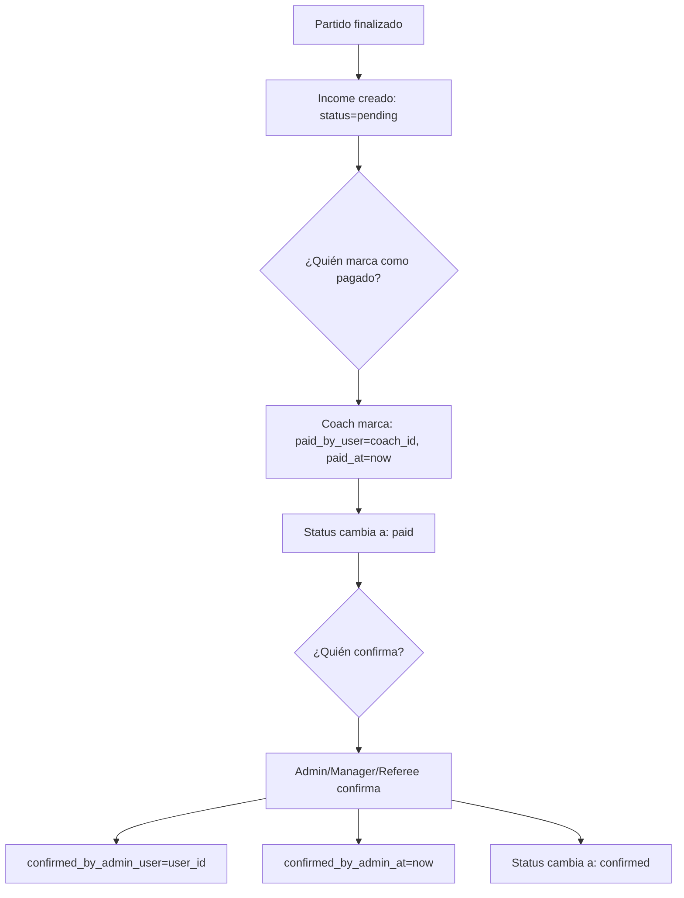
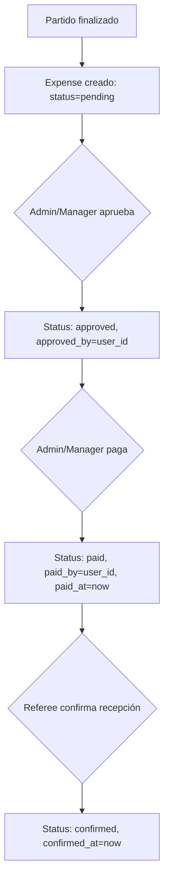

# Sistema de Permisos y Confirmación de Pagos

## 🔐 Roles y Permisos para Gestión de Partidos

### **Roles con Acceso Completo a Partidos:**

| Rol | Permisos | Rutas de Acceso |
|-----|----------|-----------------|
| **Admin** | ✅ Gestionar partidos<br>✅ Iniciar/Finalizar<br>✅ Confirmar pagos equipos<br>✅ Confirmar pagos árbitros | `/admin/matches/{id}/live` |
| **League Manager** | ✅ Gestionar partidos<br>✅ Iniciar/Finalizar<br>✅ Confirmar pagos equipos<br>✅ Confirmar pagos árbitros | `/admin/matches/{id}/live` |
| **Referee** | ✅ Ver partido asignado<br>✅ Iniciar/Finalizar<br>✅ Confirmar pagos equipos<br>✅ Confirmar recepción de su pago | `/admin/matches/{id}/live` |

---

## 🛣️ Rutas Configuradas

### **Archivo: `routes/web.php`**

```php
// Matches Routes (Admin, League Manager & Referee)
Route::middleware(['role:admin,league_manager,referee'])->group(function () {
    Route::get('/admin/matches/{matchId}/live', \App\Livewire\Matches\Live::class)
        ->name('matches.live');
});
```

### **Acceso desde Lista de Partidos:**

#### **Para Admin/League Manager:**
```
1. Ir a: /admin/fixtures
2. Click en partido → /admin/matches/{id}/live ✅
```

#### **Para Referee:**
```
1. Ir a: /referee/matches (solo ve sus partidos asignados)
2. Click en partido → /admin/matches/{id}/live ✅
```

---

## 💰 Sistema de Confirmación de Pagos

### **1. Ingresos (Pagos de Equipos)**

#### **Modelo: `Income`**

```php
protected $fillable = [
    // ... otros campos
    'payment_status',           // pending, paid, confirmed, overdue
    'paid_at',                  // Fecha cuando el equipo pagó
    'paid_by_user',             // ID del user (coach) que marcó como pagado
    'confirmed_by_admin_at',    // Fecha de confirmación por admin/manager/referee
    'confirmed_by_admin_user',  // ID del user que confirmó (admin/manager/referee)
    'confirmed_at',             // Fecha de confirmación final
    'payment_proof_url',        // Comprobante de pago
];
```

#### **Flujo de Confirmación:**



#### **Estados del Pago:**

| Estado | Descripción | Quién lo activa |
|--------|-------------|-----------------|
| `pending` | Esperando pago | Sistema (al finalizar partido) |
| `paid` | Equipo marcó como pagado | Coach del equipo |
| `confirmed` | Pago confirmado recibido | Admin/Manager/**Referee** |
| `overdue` | Pago vencido | Sistema automático |

---

### **2. Egresos (Pagos a Árbitros)**

#### **Modelo: `Expense`**

```php
protected $fillable = [
    // ... otros campos
    'payment_status',       // pending, approved, paid, confirmed
    'approved_at',          // Fecha de aprobación
    'approved_by',          // ID del user que aprobó (admin/manager)
    'paid_at',              // Fecha cuando se pagó
    'paid_by',              // ID del user que pagó (admin/manager)
    'confirmed_at',         // Fecha cuando referee confirmó recepción
    'beneficiary_user_id',  // ID del referee (User) que recibe el pago
    'referee_id',           // ID del modelo Referee
    'payment_proof_url',    // Comprobante de pago
];
```

#### **Flujo de Confirmación:**



#### **Estados del Pago:**

| Estado | Descripción | Quién lo activa |
|--------|-------------|-----------------|
| `pending` | Esperando aprobación | Sistema (al finalizar partido) |
| `approved` | Aprobado para pago | Admin/Manager |
| `paid` | Admin/Manager marcó como pagado | Admin/Manager |
| `confirmed` | Referee confirmó recepción | **Referee** (beneficiario) |

---

## 🎯 Permisos de Confirmación

### **Tabla de Permisos:**

| Acción | Admin | Manager | Referee | Coach | Player |
|--------|-------|---------|---------|-------|--------|
| **Iniciar partido** | ✅ | ✅ | ✅ | ❌ | ❌ |
| **Finalizar partido** | ✅ | ✅ | ✅ | ❌ | ❌ |
| **Confirmar pago de equipo (Income)** | ✅ | ✅ | ✅ | ❌ | ❌ |
| **Aprobar pago a árbitro** | ✅ | ✅ | ❌ | ❌ | ❌ |
| **Marcar como pagado a árbitro** | ✅ | ✅ | ❌ | ❌ | ❌ |
| **Confirmar recepción de pago** | ❌ | ❌ | ✅* | ❌ | ❌ |

*Solo puede confirmar su propio pago

---

## 🔄 Casos de Uso

### **Caso 1: Pago de Equipo**

#### **Escenario:**
- Partido finalizado
- Equipo debe pagar $500

#### **Flujo:**
```
1. Sistema genera Income:
   - team_id: 18
   - amount: 500.00
   - payment_status: pending
   - due_date: +7 días

2. Coach marca como pagado:
   - Sube comprobante
   - payment_status: paid
   - paid_by_user: coach_user_id
   - paid_at: now()

3. Admin/Manager/Referee confirma:
   - Revisa comprobante
   - payment_status: confirmed
   - confirmed_by_admin_user: user_id
   - confirmed_by_admin_at: now()
```

---

### **Caso 2: Pago a Árbitro**

#### **Escenario:**
- Partido finalizado
- Árbitro principal debe recibir $300

#### **Flujo:**
```
1. Sistema genera Expense:
   - referee_id: 3
   - beneficiary_user_id: 7 (User del referee)
   - amount: 300.00
   - payment_status: pending
   - due_date: +3 días

2. Admin/Manager aprueba:
   - payment_status: approved
   - approved_by: admin_user_id
   - approved_at: now()

3. Admin/Manager paga:
   - Realiza transferencia/pago
   - payment_status: paid
   - paid_by: admin_user_id
   - paid_at: now()

4. Referee confirma recepción:
   - Verifica que recibió el dinero
   - payment_status: confirmed
   - confirmed_at: now()
```

---

### **Caso 3: Referee Gestiona Partido Asignado**

#### **Escenario:**
- Referee "Juan Pérez" asignado al partido
- Accede desde su área de referees

#### **Flujo:**
```
1. Referee login → /referee/matches
2. Ve lista de partidos asignados (filtrados por fixture_referees)
3. Click en partido → /admin/matches/45/live ✅
4. Puede:
   - ✅ Iniciar partido (si está scheduled)
   - ✅ Registrar eventos
   - ✅ Finalizar partido
   - ✅ Confirmar pagos de equipos
   - ✅ Confirmar recepción de su pago
```

---

## 🛡️ Seguridad y Validaciones

### **Middleware Aplicado:**

```php
Route::middleware(['role:admin,league_manager,referee'])->group(function () {
    Route::get('/admin/matches/{matchId}/live', Live::class)->name('matches.live');
});
```

### **Validaciones en Componente:**

```php
// Solo puede confirmar su propio pago
public function confirmMyPayment($expenseId)
{
    $expense = Expense::findOrFail($expenseId);
    
    // Validar que sea el beneficiario
    if ($expense->beneficiary_user_id !== auth()->id()) {
        session()->flash('error', 'No puedes confirmar este pago.');
        return;
    }
    
    // Validar que esté en estado 'paid'
    if ($expense->payment_status !== 'paid') {
        session()->flash('error', 'El pago aún no ha sido realizado.');
        return;
    }
    
    // Confirmar recepción
    $expense->update([
        'payment_status' => 'confirmed',
        'confirmed_at' => now(),
    ]);
}
```

---

## 📊 Dashboard de Pagos (Propuesta)

### **Para Admin/Manager:**
```
Ingresos Pendientes:
- ✅ Confirmar pagos de equipos
- 📊 Total pendiente: $2,000
- ⏰ Próximos vencimientos

Egresos Pendientes:
- ✅ Aprobar pagos
- ✅ Marcar como pagados
- 📊 Total pendiente: $1,200
```

### **Para Referee:**
```
Mis Pagos:
- ✅ Pagos confirmados recibidos
- ⏳ Pagos pendientes de recibir
- 📊 Total cobrado este mes: $600
- 📊 Total pendiente: $300
```

---

## 🎨 UI Propuesta para Confirmaciones

### **En la Vista de Partido:**

```blade
{{-- Sección de Ingresos (si user es admin/manager/referee) --}}
@if(in_array(auth()->user()->user_type, ['admin', 'league_manager', 'referee']))
    <div class="bg-white rounded-lg shadow-sm p-4">
        <h3 class="font-semibold text-gray-900 mb-3">💰 Pagos de Equipos</h3>
        
        @foreach($match->incomes as $income)
            <div class="flex items-center justify-between p-2 bg-gray-50 rounded-lg mb-2">
                <div>
                    <div class="font-medium">{{ $income->team->name }}</div>
                    <div class="text-sm text-gray-600">${{ $income->amount }}</div>
                    <div class="text-xs">
                        @if($income->payment_status === 'pending')
                            🔴 Pendiente
                        @elseif($income->payment_status === 'paid')
                            🟡 Pagado (por confirmar)
                        @else
                            🟢 Confirmado
                        @endif
                    </div>
                </div>
                
                @if($income->payment_status === 'paid')
                    <button 
                        wire:click="confirmTeamPayment({{ $income->id }})"
                        class="px-3 py-1 bg-green-600 text-white rounded-lg text-sm"
                    >
                        ✓ Confirmar
                    </button>
                @endif
            </div>
        @endforeach
    </div>
@endif

{{-- Sección de Egresos (Pagos a Árbitros) --}}
@if(auth()->user()->user_type === 'referee')
    <div class="bg-white rounded-lg shadow-sm p-4">
        <h3 class="font-semibold text-gray-900 mb-3">💵 Mi Pago</h3>
        
        @foreach($match->expenses->where('beneficiary_user_id', auth()->id()) as $expense)
            <div class="flex items-center justify-between p-2 bg-gray-50 rounded-lg">
                <div>
                    <div class="font-medium">${{ $expense->amount }}</div>
                    <div class="text-xs">
                        @if($expense->payment_status === 'pending')
                            🔴 Pendiente de aprobación
                        @elseif($expense->payment_status === 'approved')
                            🟡 Aprobado
                        @elseif($expense->payment_status === 'paid')
                            🟢 Pagado (confirma recepción)
                        @else
                            ✅ Confirmado
                        @endif
                    </div>
                </div>
                
                @if($expense->payment_status === 'paid')
                    <button 
                        wire:click="confirmMyPayment({{ $expense->id }})"
                        class="px-3 py-1 bg-green-600 text-white rounded-lg text-sm"
                    >
                        ✓ Confirmar Recepción
                    </button>
                @endif
            </div>
        @endforeach
    </div>
@endif
```

---

## 📝 Archivos Modificados

1. ✅ `routes/web.php`
   - Agregado `referee` al middleware de `/admin/matches/{matchId}/live`

---

## 🧪 Testing

### **Probar Acceso de Referee:**

```bash
# 1. Login como referee
http://flowfast-saas.test/login

# 2. Ir a lista de partidos
http://flowfast-saas.test/referee/matches

# 3. Click en partido asignado
http://flowfast-saas.test/admin/matches/45/live ✅

# 4. Verificar acceso:
- ✅ Puede ver partido
- ✅ Puede iniciar/finalizar
- ✅ Puede registrar eventos
- ✅ Puede confirmar pagos
```

---

## 🚀 Próximos Pasos

1. **Implementar UI de confirmación de pagos** en la vista Live
2. **Agregar métodos en componente Live:**
   - `confirmTeamPayment($incomeId)`
   - `confirmMyPayment($expenseId)`
   - `approveRefereePayment($expenseId)` (solo admin/manager)
   - `markAsPaid($expenseId)` (solo admin/manager)

3. **Crear dashboard financiero para referees**
4. **Notificaciones de pagos pendientes**
5. **Historial de pagos por referee**

---

## 📚 Referencias

- [README-INGRESOS-EGRESOS-AUTOMATICOS.md](README-INGRESOS-EGRESOS-AUTOMATICOS.md) - Sistema de generación automática
- [README-RESTRUCTURACION-RUTAS.md](README-RESTRUCTURACION-RUTAS.md) - Estructura de rutas por roles
